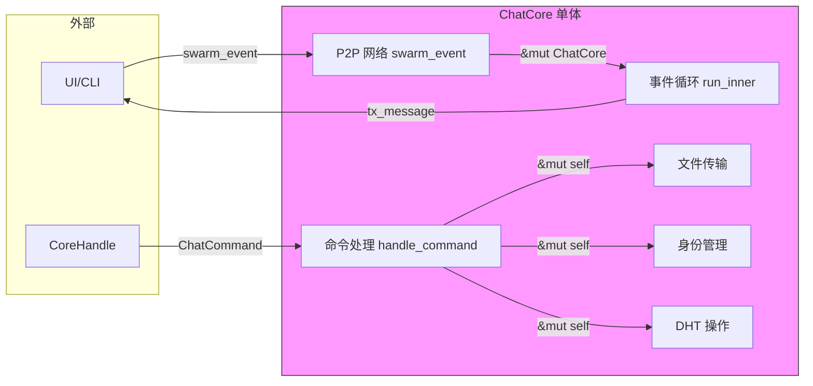
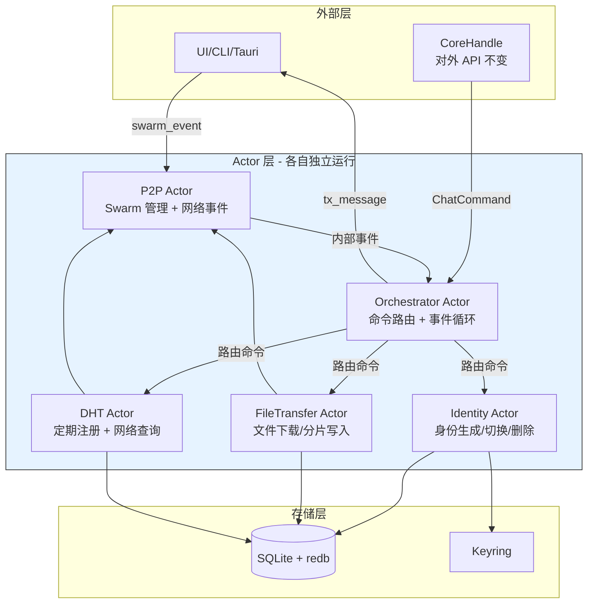
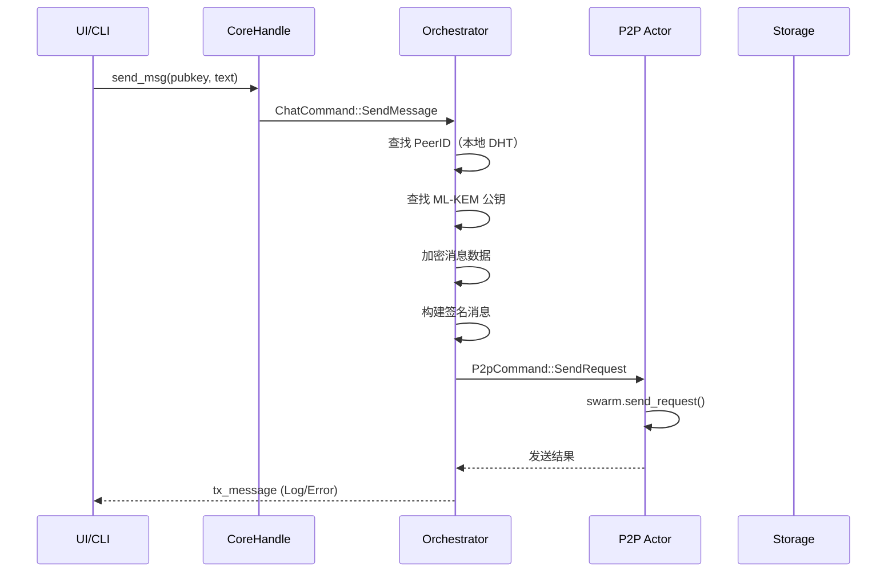
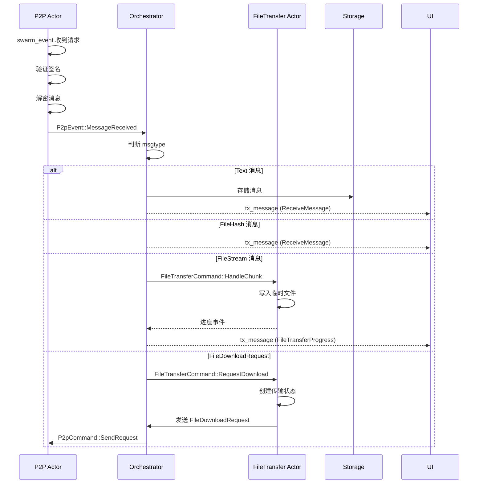
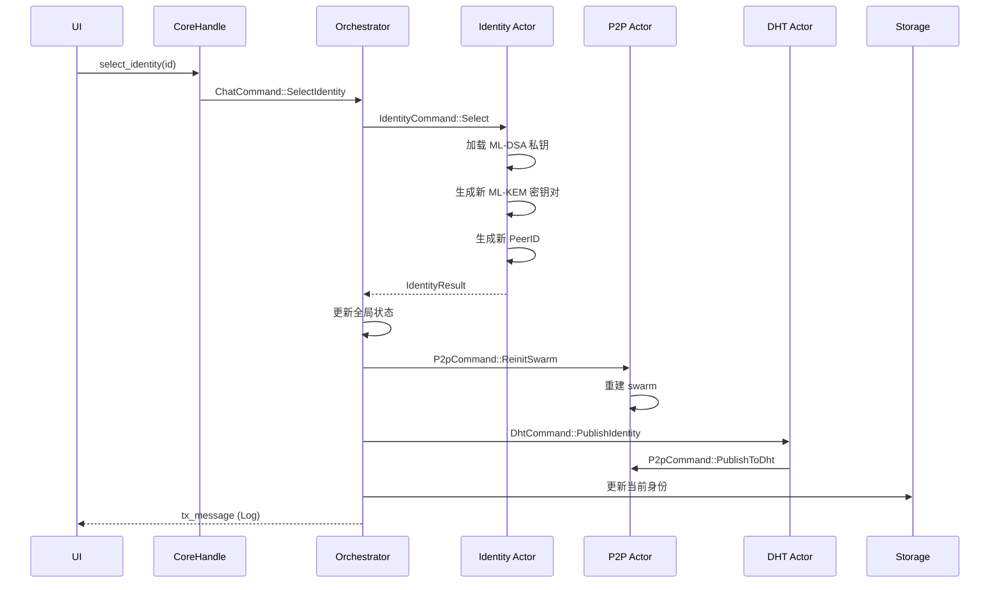

# ChatCore Actor 化重构方案

## 1. 现状分析

当前 [`ChatCore`](../chat_core/src/core/mod.rs:34) 是一个单体结构体，承担了以下所有职责：

| 职责 | 对应字段/方法 | 文件 |
|------|-------------|------|
| P2P 网络管理 | `swarm`, `validator`, `identity_keypair`, `connected_peers`, `mdns_cache` | [`mod.rs`](../chat_core/src/core/mod.rs:34) |
| 消息发送/加密 | `send_text()`, `build_signed_message()`, `send_message()` | [`command_handler.rs`](../chat_core/src/core/command_handler.rs:115) |
| 身份管理 | `generate_identity()`, `select_identity()`, `delete_identity()` | [`identity_ops.rs`](../chat_core/src/core/identity_ops.rs:5) |
| DHT 发布/查询 | `publish_identity_to_dht()`, `query_mlkem_from_dht_network()` | [`dht_ops.rs`](../chat_core/src/core/dht_ops.rs:3) |
| 文件传输 | `handle_file_download_request()`, `handle_file_stream_chunk()` | [`file_transfer.rs`](../chat_core/src/core/file_transfer.rs:75) |
| 命令分发 | `handle_command()` | [`command_handler.rs`](../chat_core/src/core/command_handler.rs:6) |
| 事件循环 | `run()`, `run_inner()`, `dht_registration_loop()` | [`event_loop.rs`](../chat_core/src/core/event_loop.rs:9) |
| 外部事件通知 | `tx_message: mpsc::Sender<ChatcoreEvent>` | [`mod.rs`](../chat_core/src/core/mod.rs:43) |

### 当前通信模式



**核心问题**：所有操作都需要 `&mut self`，导致：

- 无法并发处理网络事件和命令
- 测试时需要初始化整个 ChatCore
- 代码耦合度高，修改一个功能可能影响其他功能

---

## 2. 设计目标

1. **职责分离**：将不同职责拆分为独立的 Actor
2. **消息驱动**：Actor 之间通过消息通道通信，不再共享 `&mut self`
3. **保持现有 API 兼容**：`CoreHandle` 对外接口不变
4. **逐步迁移**：可以分阶段实施，每个阶段可独立编译和测试

---

## 3. Actor 拆分方案

### 3.1 Actor 划分



### 3.2 Actor 定义

#### Actor 1: Orchestrator（编排器）

**职责**：

- 接收 `ChatCommand` 并路由到对应的 Actor
- 维护全局状态（当前身份 ID、PeerID、data_dir 等）
- 通过 `tx_message` 向外部发送事件
- 协调跨 Actor 的操作（如身份切换后通知 DHT Actor 重新注册）

**状态**：

```rust
pub struct Orchestrator {
    // 全局状态（轻量）
    pub mldsa_pubkey_hex: Option<String>,
    pub current_peer_id: Option<PeerId>,
    pub mldsa_identity_id: Option<String>,
    pub mlkem_pubkey_hex: Option<String>,
    pub mldsa_private_key: Option<Zeroizing<Vec<u8>>>,
    pub data_dir: PathBuf,
    pub download_dir: PathBuf,
    pub dht_db: Option<Arc<redb::Database>>,

    // Actor 通道
    pub p2p_cmd_tx: mpsc::Sender<P2pCommand>,
    pub identity_cmd_tx: mpsc::Sender<IdentityCommand>,
    pub file_transfer_cmd_tx: mpsc::Sender<FileTransferCommand>,
    pub dht_cmd_tx: mpsc::Sender<DhtCommand>,

    // 外部事件通道
    pub tx_message: mpsc::Sender<ChatcoreEvent>,
}
```

**消息处理**：

```rust
pub enum OrchestratorCommand {
    // 直接由 Orchestrator 处理的命令
    SetDownloadDir { path: PathBuf },
    RegisterFileForDownload { file_id: [u8; 32], file_path: PathBuf },
    Shutdown,

    // 需要路由到其他 Actor 的命令
    SendMessage { ... },           // -> P2P Actor
    AddContact { ... },            // -> P2P Actor + Identity Actor
    GenerateIdentity,              // -> Identity Actor
    SelectIdentity { ... },        // -> Identity Actor
    DeleteIdentity { ... },        // -> Identity Actor
    RequestFileDownload { ... },   // -> FileTransfer Actor
    DiscoverContact { ... },       // -> P2P Actor
    RetryPendingMessages,          // -> P2P Actor
    DhtPublishIdentity { ... },    // -> DHT Actor
}
```

#### Actor 2: P2P Actor

**职责**：

- 管理 `Swarm<MyBehaviour>` 和 `RecordValidator`
- 处理网络事件（`swarm_event`）
- 发送消息到网络
- 处理接收到的消息（解密、验证、存储）
- 管理 `connected_peers` 和 `mdns_cache`

**状态**：

```rust
pub struct P2pActor {
    pub swarm: Swarm<MyBehaviour>,
    pub validator: Arc<RwLock<RecordValidator>>,
    pub identity_keypair: libp2p::identity::Keypair,
    pub connected_peers: HashSet<PeerId>,
    pub mdns_cache: LruCache<PeerId, Instant>,
    pub data_dir: PathBuf,
    pub dht_db: Option<Arc<redb::Database>>,
    pub orchestrator_tx: mpsc::Sender<OrchestratorEvent>,
}
```

**消息**：

```rust
pub enum P2pCommand {
    SendMessage {
        peer_id: PeerId,
        message: ChatMessage,
    },
    SendRequest {
        peer_id: PeerId,
        message: ChatMessage,
    },
    LookupPeerId {
        mldsa_pubkey_hex: String,
        resp: oneshot::Sender<Option<PeerId>>,
    },
    LookupMlkemPubkey {
        mldsa_pubkey_hex: String,
        resp: oneshot::Sender<Option<Vec<u8>>>,
    },
    ReinitSwarm {
        keypair: libp2p::identity::Keypair,
    },
    PublishToDht {
        record: libp2p::kad::Record,
    },
    GetRecord {
        key: libp2p::kad::RecordKey,
    },
}
```

**事件**（向 Orchestrator 发送）：

```rust
pub enum P2pEvent {
    MessageReceived {
        peer_id: PeerId,
        message: ChatMessage,
    },
    PeerConnected(PeerId),
    PeerDisconnected(PeerId),
    DhtRecordFound {
        key: String,
        value: Vec<u8>,
    },
    DhtQueryComplete {
        query_id: String,
        result: Option<PeerId>,
    },
}
```

#### Actor 3: Identity Actor

**职责**：

- 生成新身份（ML-DSA + ML-KEM）
- 切换身份（重新生成 ML-KEM、PeerID）
- 删除身份（清理 Keyring + DHT 墓碑记录）
- 管理 Keyring 中的私钥

**状态**：

```rust
pub struct IdentityActor {
    pub data_dir: PathBuf,
    pub orchestrator_tx: mpsc::Sender<OrchestratorEvent>,
}
```

**消息**：

```rust
pub enum IdentityCommand {
    Generate {
        resp: oneshot::Sender<IdentityResult>,
    },
    Select {
        identity_id: String,
        resp: oneshot::Sender<IdentityResult>,
    },
    Delete {
        identity_id: String,
        resp: oneshot::Sender<bool>,
    },
}

pub struct IdentityResult {
    pub mldsa_pubkey_hex: String,
    pub mlkem_pubkey_hex: String,
    pub mldsa_private_key: Zeroizing<Vec<u8>>,
    pub keypair: libp2p::identity::Keypair,
    pub peer_id: PeerId,
}
```

#### Actor 4: FileTransfer Actor

**职责**：

- 管理文件传输状态（`file_transfers`）
- 处理文件分片写入
- 断点续传
- 哈希验证
- 进度事件发送

**状态**：

```rust
pub struct FileTransferActor {
    pub file_transfers: HashMap<String, FileTransferState>,
    pub file_path_map: HashMap<[u8; 32], PathBuf>,
    pub download_dir: PathBuf,
    pub orchestrator_tx: mpsc::Sender<OrchestratorEvent>,
}
```

**消息**：

```rust
pub enum FileTransferCommand {
    RequestDownload {
        sender_mldsa_pubkey_hex: String,
        file_id: [u8; 32],
    },
    HandleChunk {
        chunk: FileStreamChunk,
    },
    RegisterFile {
        file_id: [u8; 32],
        file_path: PathBuf,
    },
}
```

#### Actor 5: DHT Actor

**职责**：

- 定期 DHT 注册循环
- 发布身份记录到 Kademlia
- 清理过期缓存

**状态**：

```rust
pub struct DhtActor {
    pub data_dir: PathBuf,
    pub orchestrator_tx: mpsc::Sender<OrchestratorEvent>,
    pub p2p_cmd_tx: mpsc::Sender<P2pCommand>,
}
```

**消息**：

```rust
pub enum DhtCommand {
    PublishIdentity {
        mldsa_pubkey_hex: String,
        peer_id: String,
        mlkem_pubkey_hex: String,
        mldsa_private_key: Zeroizing<Vec<u8>>,
        current_peer_id: PeerId,
    },
    StartRegistrationLoop,
    StopRegistrationLoop,
}
```

---

## 4. 消息流详解

### 4.1 发送消息流程



### 4.2 接收消息流程



### 4.3 身份切换流程



---

## 5. 与现有架构的兼容性

### 5.1 CoreHandle 保持不变

[`CoreHandle`](../chat_core/src/corehandle.rs:6) 的对外 API **完全不变**，只是内部实现改为向 Orchestrator 发送命令：

```rust
// CoreHandle 内部变化
pub struct CoreHandle {
    cmd_tx: mpsc::Sender<ChatCommand>,  // 现在指向 Orchestrator
}
```

### 5.2 ChatCore 变为轻量包装

```rust
pub struct ChatCore {
    // 不再包含 swarm、file_transfers 等重型字段
    // 只保留 Orchestrator 的通道和句柄
    pub core_handle: CoreHandle,
    pub tx_message: mpsc::Sender<ChatcoreEvent>,
    // run() 方法启动所有 Actor
}
```

### 5.3 初始化流程变化

```rust
// 当前
let core = ChatCore::try_init(cfg).await?;
let rx = core.take_rx_message();
let handle = core.handler();
let thread = core.run().await;

// 重构后
let (core, actors) = ChatCore::try_init(cfg).await?;
// core 包含 handle 和 tx_message
// actors 是各 Actor 的 JoinHandle 集合
// 所有 Actor 在独立任务中运行
```

---

## 6. 分阶段实施计划

### Phase 1: 提取 P2P Actor（最小侵入）

**目标**：将 `Swarm` 和网络事件处理移到独立 Actor 中。

**改动范围**：

1. 新建 `chat_core/src/actor/p2p_actor.rs`
2. 定义 `P2pCommand` 和 `P2pEvent` 枚举
3. Orchestrator 持有 `p2p_cmd_tx`，P2P Actor 持有 `orchestrator_tx`
4. `swarm_event()` 改为向 Orchestrator 发送 `P2pEvent`
5. `send_message()` 改为通过 `p2p_cmd_tx` 发送

**风险**：低。P2P 网络是相对独立的模块，提取后不影响其他功能。

### Phase 2: 提取 FileTransfer Actor

**目标**：将文件传输状态管理移到独立 Actor。

**改动范围**：

1. 新建 `chat_core/src/actor/file_transfer_actor.rs`
2. 定义 `FileTransferCommand` 枚举
3. 从 `ChatCore` 中移除 `file_transfers` 和 `file_path_map` 字段

**风险**：中。文件传输涉及多个消息类型交互，需要确保事件流正确。

### Phase 3: 提取 Identity Actor

**目标**：将身份管理操作移到独立 Actor。

**改动范围**：

1. 新建 `chat_core/src/actor/identity_actor.rs`
2. 定义 `IdentityCommand` 枚举
3. 身份切换后通过 `OrchestratorEvent` 通知 Orchestrator 更新状态

**风险**：中。身份切换涉及 swarm 重建，需要与 P2P Actor 协调。

### Phase 4: 提取 DHT Actor

**目标**：将 DHT 定期注册循环移到独立 Actor。

**改动范围**：

1. 新建 `chat_core/src/actor/dht_actor.rs`
2. 从 `event_loop.rs` 中移出 `dht_registration_loop`

**风险**：低。DHT 注册循环已经是独立的任务。

---

## 7. 关键设计决策

### 7.1 为什么 Orchestrator 持有全局状态？

虽然理想情况下每个 Actor 完全独立，但以下状态被多个 Actor 共享：

- `mldsa_private_key`：发送消息（P2P Actor）和 DHT 发布（DHT Actor）都需要
- `mldsa_pubkey_hex` / `mlkem_pubkey_hex`：几乎所有操作都需要
- `dht_db`：发送消息和 DHT 操作都需要

将这些状态放在 Orchestrator 中，通过命令参数传递给其他 Actor，避免共享内存。

### 7.2 为什么不使用共享内存（Arc<RwLock<>>）？

1. **测试性**：Actor 之间通过消息通信，可以轻松 mock
2. **并发性**：避免锁竞争，每个 Actor 在自己的任务中运行
3. **清晰性**：消息流明确，易于调试和追踪
4. **一致性**：Actor 处理消息是原子的，不会出现部分更新

### 7.3 错误处理策略

每个 Actor 内部使用 `tracing` 记录错误，通过 `OrchestratorEvent` 向 Orchestrator 报告严重错误。Orchestrator 负责将错误转换为 `MessageEvent::Error` 发送到 UI。

---

## 8. 测试策略

### 8.1 Actor 单元测试

每个 Actor 可以独立测试，只需 mock 其依赖的通道：

```rust
#[tokio::test]
async fn test_file_transfer_actor() {
    let (orchestrator_tx, mut orchestrator_rx) = mpsc::channel(64);
    let (cmd_tx, mut cmd_rx) = mpsc::channel(64);
    let mut actor = FileTransferActor::new(download_dir, orchestrator_tx);

    // 发送命令
    cmd_tx.send(FileTransferCommand::HandleChunk { ... }).await;

    // 验证 Actor 响应
    tokio::select! {
        event = orchestrator_rx.recv() => {
            // 验证事件
        }
        _ = tokio::time::sleep(Duration::from_secs(1)) => {
            panic!("Actor did not respond");
        }
    }
}
```

### 8.2 集成测试

通过 `CoreHandle` 发送命令，验证 `tx_message` 接收到的最终事件。

---

## 9. 不在此方案范围内的改进

- **全局静态回调表**（[`p2p/mod.rs:21`](../chat_core/src/p2p/mod.rs:21)）：DHT 查询回调通过 Actor 内部通道替代，自然消除全局状态
- **`run()` 消耗 self**（[`event_loop.rs:11`](../chat_core/src/event_loop.rs:11)）：Actor 化后不再需要 `run()` 方法，Orchestrator 在后台运行
- **文件路径规范化**（[`command_handler.rs:64`](../chat_core/src/command_handler.rs:64)）：在 Orchestrator 初始化时统一处理
