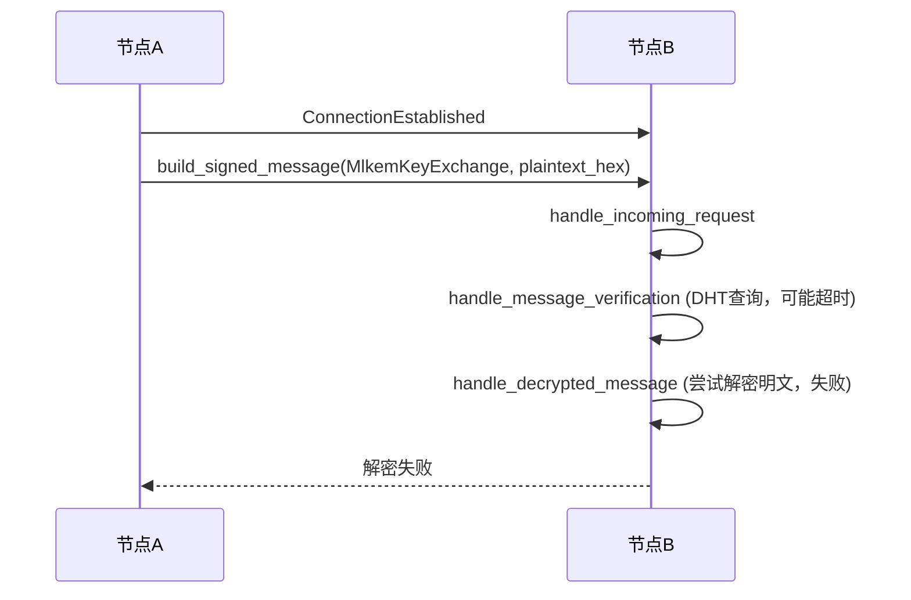
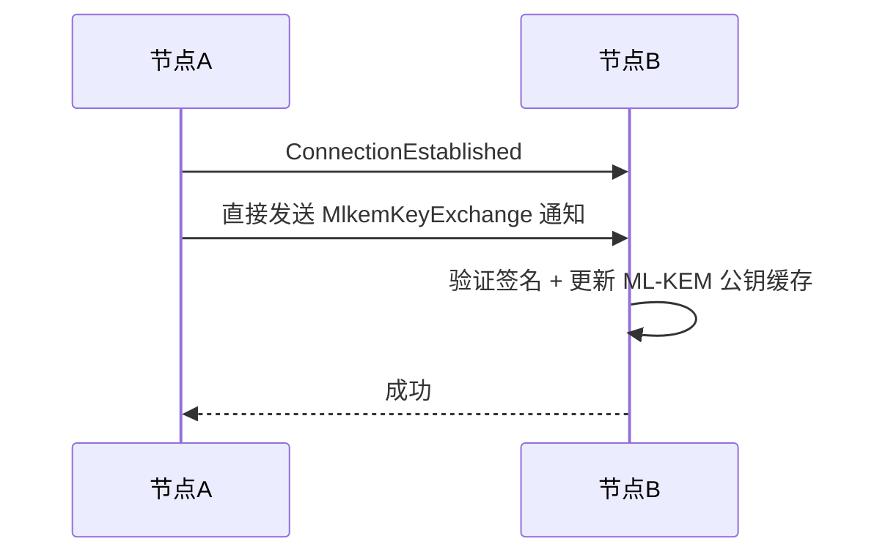

# 加密/密钥交换架构优化方案

## 紧急修复：让消息发送先跑起来

### 当前错误链

```
发送方: "本地未缓存 PeerID" → 消息进入离线队列
接收方: "解密失败: Encrypted data too short" → 发送 MlkemKeyExchange
```

### 根本原因

1. **发送方找不到接收方的 PeerID**：`send_text_impl` 通过 DHT 本地数据库查找 PeerID，但 DHT 绑定记录可能尚未同步。`try_find_peerid_via_connection` 发起 DHT 网络查询（8秒超时），但 DHT 查询可能失败（NAT 后的节点）。

2. **接收方无法解密消息**：即使连接已建立，接收方收到的消息可能使用了过期的 ML-KEM 公钥加密，或者消息数据格式不正确。

3. **MlkemKeyExchange 消息走普通消息通道**：密钥交换消息需要经过 DHT 验证+解密，但数据是明文。

### 紧急修复步骤

#### 步骤 1：ConnectionEstablished 中缓存 PeerID 映射

在 [`ConnectionEstablished`](chat_core/src/p2p/events.rs:147) 事件中，当收到 `MlkemKeyExchange` 消息时，将对方的 PeerID 和 ML-DSA 公钥的映射关系缓存到 DHT 本地数据库。

**修改文件**：[`events.rs`](chat_core/src/p2p/events.rs)

在 `handle_mlkem_key_exchange` 中，除了更新 ML-KEM 公钥，还添加 PeerID 绑定记录：

```rust
// 缓存 PeerID 绑定记录
if let Ok(store) = core.get_dht_store() {
    let _ = store.set_pubkey_peerid(sender_mldsa_pubkey_hex, &peer);
}
```

#### 步骤 2：MlkemKeyExchange 绕过 DHT 验证+解密（已完成）

在 [`handle_incoming_request`](chat_core/src/p2p/events.rs:647-689) 中，`MlkemKeyExchange` 消息直接验证签名后处理，跳过 DHT 身份绑定验证和解密。

#### 步骤 3：解密失败时自动发送 MlkemKeyExchange（已完成）

在 [`handle_decrypted_message`](chat_core/src/p2p/events.rs:1028-1054) 中，解密失败时自动向对方发送当前 ML-KEM 公钥。

### 验证方法

1. 双方重启应用（加载新代码）
2. 等待连接建立（mDNS 发现）
3. A 发送消息给 B
4. 检查 B 是否能正确解密并显示消息
5. 检查 A 是否能收到送达回执

## 当前问题

### 问题 1：ML-KEM 密钥对每次重启重新生成

[`identity.rs:109-110`](chat_core/src/identity.rs:109) 每次应用启动都生成新的 ML-KEM 密钥对：

```rust
let (mlkem_public_key, mlkem_secret_key) = crate::crypto::generate_mlkem_keypair()?;
```

这导致：

- 旧的加密消息永远无法解密
- 发送方必须获取接收方的最新公钥才能发送消息
- 如果 DHT 网络不可用，密钥交换失败，消息无法发送

### 问题 2：MlkemKeyExchange 消息走普通消息通道

[`ConnectionEstablished`](chat_core/src/p2p/events.rs:169-182) 中发送的 `MlkemKeyExchange` 消息走的是 request/response 协议通道，但：

- 数据是明文 hex（不需要解密）
- 连接已建立，peer_id 已知（不需要 DHT 身份绑定验证）
- DHT 查询可能超时（NAT 后的节点）

### 问题 3：发送方可能使用过期的 ML-KEM 公钥

[`lookup_mlkem_pubkey`](chat_core/src/core/message_ops.rs:152-240) 的查询链是：contacts 表 → DHT 本地数据库 → 离线队列。如果 contacts 表或 DHT 本地数据库中有旧的 ML-KEM 公钥，发送方会直接使用它。

### 问题 4：解密失败时没有有效的自动恢复机制

[`handle_decrypted_message`](chat_core/src/p2p/events.rs:1001-1056) 解密失败时，虽然现在会发送 `MlkemKeyExchange` 消息，但：

- 这条消息本身可能再次触发解密失败（如果接收方还没更新代码）
- 没有重试机制

---

## 优化方案

### 方案 A：ML-KEM 密钥对持久化（推荐，高优先级）

**思路**：ML-KEM 密钥对不再每次重启重新生成，而是像 ML-DSA 密钥对一样持久化到安全存储。

**修改文件**：[`identity.rs`](chat_core/src/identity.rs)

```rust
// 修改前：每次生成新的
let (mlkem_public_key, mlkem_secret_key) = crate::crypto::generate_mlkem_keypair()?;

// 修改后：尝试加载已有的，不存在时才生成新的
let (mlkem_public_key, mlkem_secret_key) = load_or_generate_mlkem_keypair(&data_dir, &identity_id)?;
```

**优点**：

- 旧的加密消息仍然可以解密
- 不需要每次连接都交换 ML-KEM 公钥
- 大幅减少 "ML-KEM 公钥过期" 问题

**缺点**：

- 失去前向保密性（如果私钥泄露，所有历史消息可解密）
- 但当前设计已经是这样（私钥存储在 Keyring 中）

### 方案 B：MlkemKeyExchange 使用独立协议（推荐，中优先级）

**思路**：`MlkemKeyExchange` 消息不经过 request/response 通道，而是使用 libp2p 的 notification 协议或在 `ConnectionEstablished` 事件中通过带外方式直接处理。

**当前设计**：



**优化后设计**：



**实现方式**：在 libp2p 的 `swarm` 中注册一个独立的 notification 协议，专门用于密钥交换。

### 方案 C：发送消息前验证 ML-KEM 公钥（中优先级）

**思路**：在 [`lookup_mlkem_pubkey`](chat_core/src/core/message_ops.rs:152-240) 中，即使本地有缓存的 ML-KEM 公钥，也发起异步 DHT 网络查询验证是否最新。

**当前流程**：

```
contacts表 → DHT本地数据库 → 离线队列
```

**优化后流程**：

```
contacts表 → DHT本地数据库 → 异步DHT网络验证（非阻塞）→ 使用缓存公钥发送
                                    ↓ (DHT返回新公钥)
                              更新本地缓存，下次使用
```

### 方案 D：解密失败时自动重试（低优先级）

**思路**：当 [`handle_decrypted_message`](chat_core/src/p2p/events.rs:1001-1056) 解密失败时，不直接丢弃消息，而是：

1. 保存消息到临时队列
2. 发送 `MlkemKeyExchange` 消息给对方
3. 等待对方回复新的 ML-KEM 公钥
4. 用新公钥重新加密消息并请求对方重发

---

## 推荐的综合优化方案

### 第一阶段：让消息发送跑起来（立即执行）

1. **编译部署当前修复**：包含 `MlkemKeyExchange` 绕过 DHT 验证+解密、解密失败自动发送密钥交换消息
2. **验证消息发送是否正常**

### 第二阶段：架构优化（短期）

1. **ML-KEM 密钥对持久化**（方案 A）— 解决根本问题
2. **MlkemKeyExchange 使用独立协议**（方案 B）— 提高可靠性

### 第三阶段：增强（长期）

1. **发送消息前验证 ML-KEM 公钥**（方案 C）
2. **解密失败自动重试**（方案 D）

---

## 文件修改清单

| 阶段 | 文件 | 修改内容 |
|------|------|---------|
| 立即 | [`chat_core/src/p2p/events.rs`](chat_core/src/p2p/events.rs) | ✅ `MlkemKeyExchange` 绕过 DHT 验证+解密 |
| 立即 | [`chat_core/src/p2p/events.rs`](chat_core/src/p2p/events.rs) | ✅ 解密失败自动发送密钥交换消息 |
| 立即 | [`chat_core/src/core/message_ops.rs`](chat_core/src/core/message_ops.rs) | ✅ `retry_pending_messages` 修复非 Text 消息解码 |
| 立即 | [`chat_core/src/core/message_ops.rs`](chat_core/src/core/message_ops.rs) | ✅ `send_text_impl` 返回 message_hash |
| 立即 | [`chat_core/src/storage/message.rs`](chat_core/src/storage/message.rs) | ✅ 新增 `update_message_hash` |
| 短期 | [`chat_core/src/identity.rs`](chat_core/src/identity.rs) | ML-KEM 密钥对持久化 |
| 短期 | [`chat_core/src/p2p/events.rs`](chat_core/src/p2p/events.rs) | MlkemKeyExchange 使用独立 notification 协议 |
| 中期 | [`chat_core/src/core/message_ops.rs`](chat_core/src/core/message_ops.rs) | 发送消息前异步 DHT 验证 ML-KEM 公钥 |
