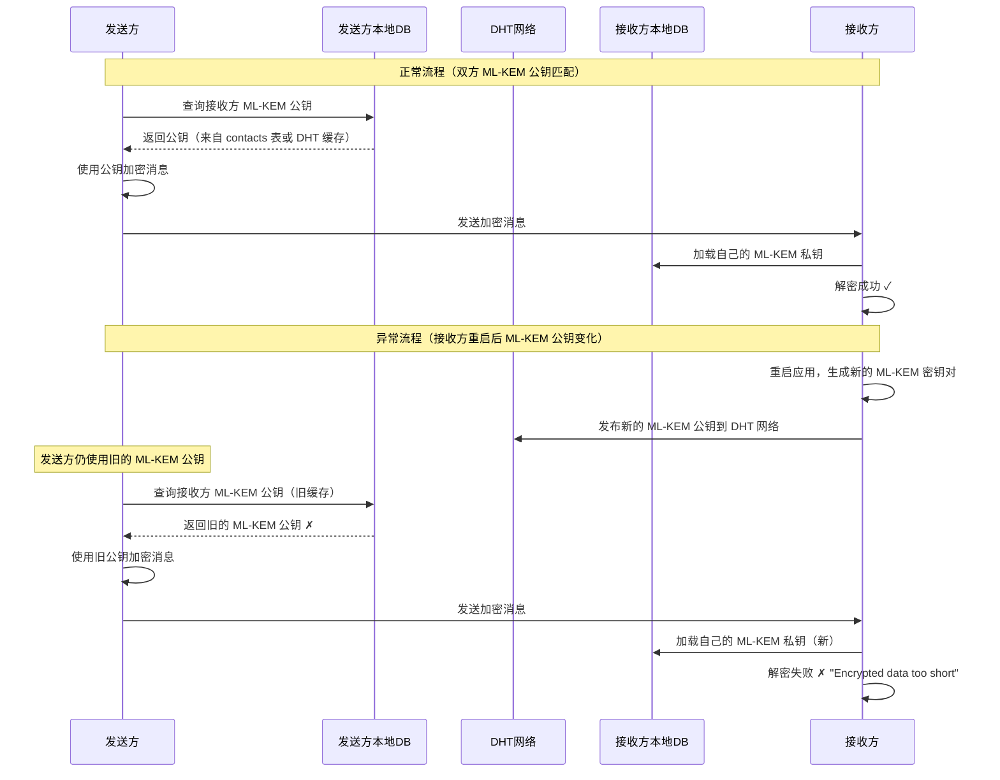
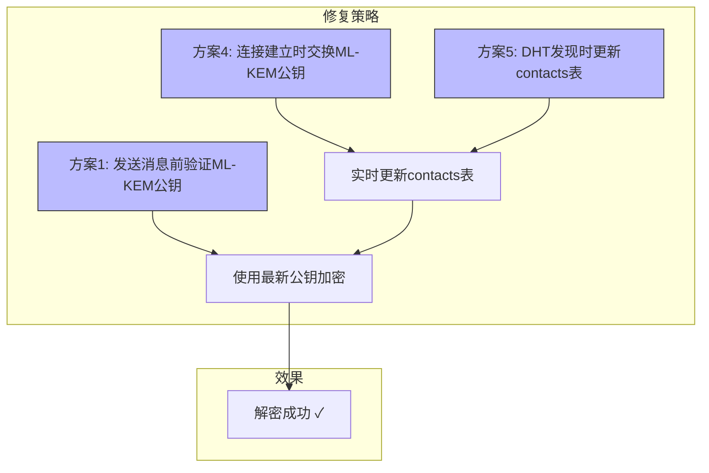

# ML-KEM 公钥过期导致解密失败修复方案

## 问题描述

当接收方重新启动应用时，会生成新的 ML-KEM 密钥对（临时密钥，每次会话重新生成）。但发送方仍然使用旧的 ML-KEM 公钥加密消息，导致接收方解密失败，错误信息为：

> "Encrypted data too short to contain KEM ciphertext"

## 根因分析

### 加密/解密流程



### 关键代码路径

1. **ML-KEM 密钥对生成**（每次会话重新生成）：
   - [`identity.rs:109-110`](chat_core/src/identity.rs:109) — `generate_mlkem_keypair()` 在 `load_or_generate_complete_identity()` 中调用
   - 新私钥保存到 Keyring（覆盖旧的），新公钥返回给 ChatCore

2. **发送方查找 ML-KEM 公钥**（查询链）：
   - [`command_handler.rs:198-265`](chat_core/src/core/command_handler.rs:198) — `lookup_mlkem_pubkey()` 方法
   - 查询链：`contacts` 表 → DHT 本地数据库 → 离线队列 + DHT 网络查询
   - **问题**：如果 contacts 表或 DHT 本地数据库中有旧的 ML-KEM 公钥，发送方会直接使用它，不会先通过网络查询验证是否最新

3. **接收方解密**：
   - [`events.rs:782`](chat_core/src/p2p/events.rs:782) — `crypto::decrypt_message()` 使用本地 ML-KEM 私钥解密
   - [`crypto.rs:182-186`](chat_core/src/crypto.rs:182) — 数据长度检查失败，因为加密时使用的公钥与当前私钥不匹配

4. **DHT 发布新公钥**：
   - [`dht_ops.rs:82-129`](chat_core/src/core/dht_ops.rs:82) — `publish_identity_to_dht()` 发布新的 ML-KEM 公钥
   - [`event_loop.rs:53-71`](chat_core/src/core/event_loop.rs:53) — 启动后立即发布一次
   - [`event_loop.rs:147-166`](chat_core/src/core/event_loop.rs:147) — 每 5 分钟定期重新发布

5. **启动后 DHT 发现联系人**：
   - [`event_loop.rs:73-97`](chat_core/src/core/event_loop.rs:73) — 启动后对所有联系人发起 DHT 发现
   - 这会更新本地 DHT 数据库中的 PeerID 和 ML-KEM 公钥缓存
   - **但不会更新 contacts 表中的 ML-KEM 公钥**

### 根本原因总结

| 原因 | 说明 |
|------|------|
| **ML-KEM 公钥是临时的** | 每次应用重启重新生成，旧的加密数据无法用新私钥解密 |
| **发送方缓存了旧的公钥** | contacts 表和 DHT 本地数据库中的缓存不会自动失效 |
| **DHT 网络查询是异步的** | `lookup_mlkem_pubkey()` 在本地缓存未命中时才发起网络查询，且不等待结果 |
| **contacts 表不自动更新** | 即使 DHT 网络查询返回了新的 ML-KEM 公钥，contacts 表中的旧值也不会被更新 |

## 修复方案

### 方案 1：发送消息前强制 DHT 网络查询（推荐）

**思路**：在 `send_text()` 中，即使本地 contacts 表或 DHT 数据库中有缓存的 ML-KEM 公钥，也先通过 DHT 网络查询验证是否最新。如果 DHT 网络返回了不同的公钥，使用新公钥并更新本地缓存。

**优点**：

- 确保始终使用最新的 ML-KEM 公钥
- 自动更新本地缓存

**缺点**：

- 增加发送延迟（DHT 网络查询需要 30 秒超时）
- 如果 DHT 网络不可用，消息会进入离线队列

**实现要点**：

- 修改 [`command_handler.rs:198-265`](chat_core/src/core/command_handler.rs:198) 的 `lookup_mlkem_pubkey()` 方法
- 在步骤 1（contacts 表查询）和步骤 2（DHT 本地数据库查询）之后，增加一个**可选的 DHT 网络验证步骤**
- 使用非阻塞方式：先发起 DHT 网络查询，同时用缓存的公钥加密发送，如果 DHT 返回了新公钥，更新缓存供下次使用
- 或者：阻塞等待 DHT 网络查询结果（有超时），确保使用最新公钥

### 方案 2：解密失败时自动重试（推荐）

**思路**：当 [`events.rs:782`](chat_core/src/p2p/events.rs:782) 解密失败时，不直接丢弃消息，而是：

1. 通过 DHT 网络查询发送方最新的 ML-KEM 公钥
2. 如果找到新的公钥，用新公钥重新加密消息并请求发送方重发
3. 或者：接收方主动用新私钥重新生成，但这是不可能的（因为加密数据是用旧公钥加密的）

**实际上这个方案不可行**，因为用旧公钥加密的数据无法用新私钥解密。ML-KEM 是密钥封装机制，不是非对称加密，无法用新私钥解密旧公钥加密的数据。

**修正方案**：解密失败时，接收方通过 DHT 网络查询发送方最新的 ML-KEM 公钥，然后**请求发送方用新公钥重新发送消息**。

**优点**：

- 用户无感知，自动修复
- 不需要修改发送方逻辑

**缺点**：

- 实现复杂，需要新增消息重发协议
- 需要发送方配合（保存已发送消息的原始数据）

### 方案 3：ML-KEM 公钥版本号机制

**思路**：在 DHT 发布的 ML-KEM 公钥记录中添加版本号（或使用时间戳），发送方在加密前检查版本号是否与本地缓存一致。

**优点**：

- 发送方可以提前知道公钥已过期
- 不需要解密失败后的重试

**缺点**：

- 需要修改 `SignedIdentityRecord` 结构体
- 需要修改 DHT 发布和查询逻辑
- 向后兼容性问题

### 方案 4：连接建立时交换 ML-KEM 公钥（推荐）

**思路**：在 libp2p 连接建立时（[`events.rs:147-168`](chat_core/src/p2p/events.rs:147)），双方交换最新的 ML-KEM 公钥。这样发送方在发送消息前就已经有了接收方的最新公钥。

**优点**：

- 实时性最好，连接建立后立即获得最新公钥
- 不需要额外的 DHT 网络查询
- 不依赖 DHT 网络的可用性

**缺点**：

- 需要新增协议消息类型（ML-KEM 公钥交换）
- 需要修改连接建立处理逻辑
- 如果连接是通过 relay 建立的，可能无法直接交换

**实现要点**：

- 在 [`events.rs:147-168`](chat_core/src/p2p/events.rs:147) 的 `ConnectionEstablished` 处理中，发送一条包含当前 ML-KEM 公钥的协议消息
- 接收方收到后，更新 contacts 表和 DHT 本地数据库中的 ML-KEM 公钥缓存
- 后续发送消息时使用更新后的公钥

### 方案 5：DHT 发现时更新 contacts 表

**思路**：当 [`events.rs:432-505`](chat_core/src/p2p/events.rs:432) 的 `handle_mlkem_record()` 从 DHT 网络获取到新的 ML-KEM 公钥时，除了更新 DHT 本地数据库，还更新 SQLite contacts 表中的 ML-KEM 公钥。

**优点**：

- 自动更新，不需要用户手动操作
- 利用了现有的 DHT 查询回调机制

**缺点**：

- 只解决了 DHT 查询后的更新，不解决发送消息时使用旧缓存的问题
- 如果发送方在 DHT 查询完成前就发送消息，仍然会使用旧公钥

**实现要点**：

- 在 [`events.rs:499-503`](chat_core/src/p2p/events.rs:499) 的 `complete_mlkem_callback()` 之后，增加更新 contacts 表的逻辑
- 需要获取 `owner_identity_id` 和数据库连接

### 方案 6：改进错误提示

**思路**：改进 [`events.rs:801-808`](chat_core/src/p2p/events.rs:801) 的错误提示，提供更具体的操作指引。

**当前提示**：
> "解密来自 ... 的消息失败。可能是对方的 ML-KEM 公钥已过期，请让对方重新添加你为好友以交换新密钥。"

**改进建议**：

- 提示用户让对方重新发送消息（对方重启后已发布新公钥到 DHT）
- 或者提示用户手动触发 DHT 发现以获取最新公钥
- 提供自动重试选项

## 推荐的综合修复方案

结合方案 1、方案 4 和方案 5，形成一个完整的修复策略：



### 具体实现步骤

#### 步骤 1：连接建立时交换 ML-KEM 公钥（方案 4）

**修改文件**：[`events.rs`](chat_core/src/p2p/events.rs)

在 [`ConnectionEstablished`](chat_core/src/p2p/events.rs:147) 事件处理中，新增一条 ML-KEM 公钥交换消息：

```rust
// 在 ConnectionEstablished 处理中，发送当前 ML-KEM 公钥给对方
if let Some(mlkem_hex) = core.mlkem_pubkey_hex.clone() {
    let exchange_msg = core.build_signed_message(
        ChatMessageType::MlkemKeyExchange,  // 新增消息类型
        mlkem_hex.as_bytes().to_vec(),
    ).await;
    core.send_message(peer_id, exchange_msg);
}
```

**新增消息类型**：在 [`ChatMessageType`](chat_core/src/message/mod.rs:22) 枚举中新增 `MlkemKeyExchange = 5`

**处理入站 ML-KEM 公钥交换消息**：在 [`handle_decrypted_message()`](chat_core/src/p2p/events.rs:751) 中新增分支：

```rust
ChatMessageType::MlkemKeyExchange => {
    // 解析 ML-KEM 公钥 hex
    let mlkem_hex = String::from_utf8(decrypted_data)?;
    // 更新 contacts 表
    storage::update_contact_mlkem_pubkey(pool, identity_id, sender_mldsa_pubkey_hex, &hex::decode(&mlkem_hex)?).await?;
    // 更新 DHT 本地数据库
    if let Ok(store) = core.get_dht_store() {
        let _ = store.set_mlkem_pubkey(sender_mldsa_pubkey_hex, &mlkem_hex);
    }
}
```

#### 步骤 2：DHT 发现时更新 contacts 表（方案 5）

**修改文件**：[`events.rs`](chat_core/src/p2p/events.rs)

在 [`handle_mlkem_record()`](chat_core/src/p2p/events.rs:432) 中，当从 DHT 获取到新的 ML-KEM 公钥时，除了更新 DHT 本地数据库，还更新 SQLite contacts 表：

```rust
// 在 handle_mlkem_record 中，写入 DHT 数据库后，也更新 contacts 表
if let Some(pool) = storage::pool() {
    if let Some(owner_id) = core.mldsa_identity_id.as_deref() {
        if let Ok(mlkem_bytes) = hex::decode(&signed.value) {
            let _ = storage::update_contact_mlkem_pubkey(
                pool, owner_id, pubkey_hex, &mlkem_bytes,
            ).await;
        }
    }
}
```

**注意**：`handle_mlkem_record()` 当前是同步函数（没有 `async`），需要改为异步或通过命令通道异步更新。

#### 步骤 3：发送消息前验证 ML-KEM 公钥（方案 1）

**修改文件**：[`command_handler.rs`](chat_core/src/core/command_handler.rs)

在 [`lookup_mlkem_pubkey()`](chat_core/src/core/command_handler.rs:198) 中，在步骤 2（DHT 本地数据库查询）之后，增加一个**快速 DHT 网络验证**步骤：

```rust
// 步骤 3（新增）：快速 DHT 网络验证
// 如果本地有缓存的 ML-KEM 公钥，发起异步 DHT 网络查询验证是否最新
// 使用非阻塞方式：先使用缓存公钥加密发送，同时发起 DHT 查询
// 如果 DHT 返回了不同的公钥，更新本地缓存供下次使用
if let Ok(store) = self.get_dht_store() {
    let mlkem_key = format!("mlkem:{}", mldsa_pubkey_hex);
    let key = libp2p::kad::RecordKey::new(&mlkem_key);
    let query_id = format!("mlkem_{}", mldsa_pubkey_hex);
    let _rx = crate::p2p::register_mlkem_query_callback(query_id);
    let _query_id = self.swarm.behaviour_mut().kademlia.get_record(key);
    tracing::debug!(
        "异步发起 DHT ML-KEM 公钥验证（非阻塞）for {}",
        pubkey_short
    );
}
```

这样，即使本次消息使用了旧的 ML-KEM 公钥，下次发送时就会使用新的公钥。

#### 步骤 4：改进错误提示（方案 6）

**修改文件**：[`events.rs`](chat_core/src/p2p/events.rs)

改进 [`events.rs:801-808`](chat_core/src/p2p/events.rs:801) 的错误提示，提供更具体的操作指引：

```rust
let msg = format!(
    "解密来自 {} 的消息失败: {}。\n\
     可能的原因：对方的 ML-KEM 公钥已过期（对方重启了应用）。\n\
     解决方法：\n\
     1. 请让对方重新发送消息（对方已发布新公钥到 DHT 网络）\n\
     2. 或者点击"重新发现"按钮手动更新联系人信息\n\
     3. 如果问题持续，请让对方重新添加你为好友",
    &sender_mldsa_pubkey_hex[..16],
    e
);
```

## 文件修改清单

| 文件 | 修改内容 | 优先级 |
|------|---------|--------|
| [`chat_core/src/message/mod.rs`](chat_core/src/message/mod.rs) | 新增 `ChatMessageType::MlkemKeyExchange` 枚举值 | 高 |
| [`chat_core/src/p2p/events.rs`](chat_core/src/p2p/events.rs) | 1. `ConnectionEstablished` 中发送 ML-KEM 公钥交换消息<br>2. `handle_decrypted_message` 中处理 `MlkemKeyExchange` 类型<br>3. `handle_mlkem_record` 中更新 contacts 表<br>4. 改进解密失败错误提示 | 高 |
| [`chat_core/src/core/command_handler.rs`](chat_core/src/core/command_handler.rs) | `lookup_mlkem_pubkey` 中增加异步 DHT 网络验证 | 中 |
| [`chat_core/src/storage/contact.rs`](chat_core/src/storage/contact.rs) | 可能需要新增批量更新方法 | 低 |

## 风险与注意事项

1. **向后兼容性**：新增的 `MlkemKeyExchange` 消息类型需要旧版本客户端能够忽略（当前使用 `#[non_exhaustive]` 枚举，匹配时使用 `_` 通配符处理未知类型）

2. **DHT 网络延迟**：DHT 网络查询可能需要几秒到几十秒，非阻塞方式可以避免阻塞主循环

3. **contacts 表更新竞态**：多个路径可能同时更新 contacts 表中的 ML-KEM 公钥，需要使用 `ON CONFLICT` 或事务确保一致性

4. **消息类型枚举扩展**：当前 [`handle_decrypted_message()`](chat_core/src/p2p/events.rs:813) 使用 `match` 匹配所有已知类型，新增 `MlkemKeyExchange` 后需要添加对应分支

5. **测试**：需要测试以下场景：
   - A 和 B 互为好友，B 重启后 A 发送消息
   - A 和 B 互为好友，B 重启后 A 通过 DHT 发现获取新公钥
   - A 和 B 互为好友，B 重启后 A 和 B 重新建立连接
   - 旧版本客户端收到 `MlkemKeyExchange` 消息
