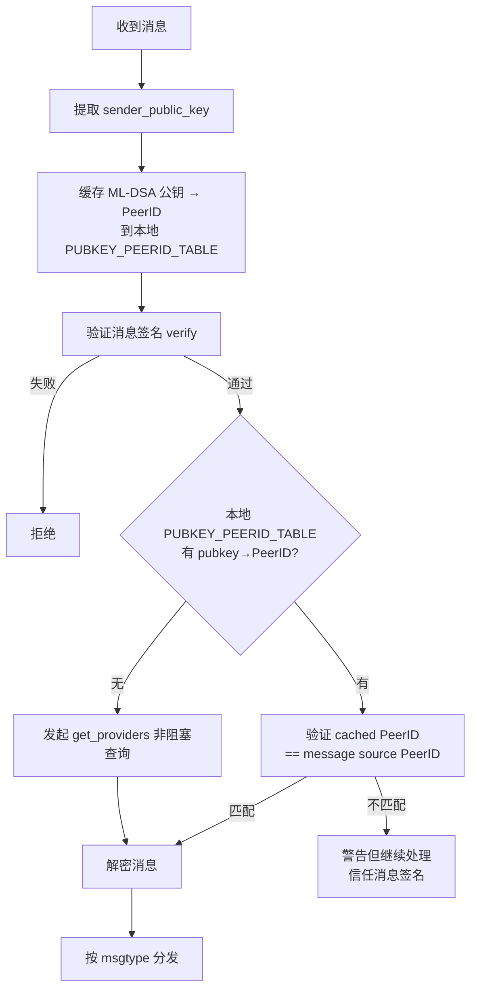
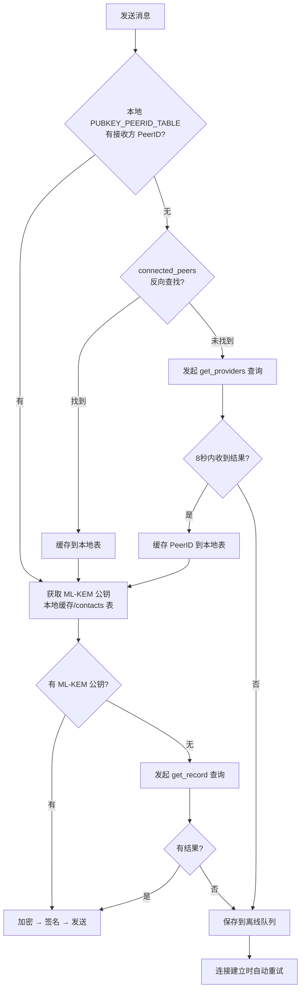

# Kademlia 原生 Provider 机制改造方案（最终版）

## 目标

模仿 Kademlia 原生的 DHT 机制，用 `start_providing`/`get_providers` 替代当前自定义的 `peerid:` 签名记录方案，提高健壮性，保证简洁性，同时保留核心安全层。

## 安全第一原则 + 中间人冒充风险分析

### 核心安全锚点：ML-DSA 签名

消息的 `sender_public_key` 字段包含完整的 ML-DSA 公钥（1952 字节），接收方用这个公钥验证消息签名。**ML-DSA 签名是最终的安全锚点**，身份绑定（ML-DSA 公钥 ↔ PeerID）是辅助验证层。

### 中间人冒充攻击场景分析

| 攻击场景 | 当前方案防护 | 新方案防护 | 安全性变化 |
|----------|-------------|-----------|-----------|
| Mallory 在 DHT 发布 provider 冒充 Alice | `SignedIdentityRecord` 签名验证（Mallory 没有 Alice 的 ML-DSA 私钥） | Kademlia 协议保证 provider 声明由节点 PeerID 签名（Mallory 的 PeerID ≠ Alice 的 PeerID） | **等价** |
| Mallory 截获 Alice 消息重放给 Charlie | 消息签名 + 新鲜度检查 + 身份绑定 PeerID 不匹配 | 消息签名 + 新鲜度检查 + provider PeerID 不匹配 | **等价** |
| Mallory 控制 DHT 路由篡改查询结果 | `SignedIdentityRecord` 的 ML-DSA 签名验证 | Kademlia 冗余查询（parallelism=3）+ 协议层验证 | **等价** |
| Mallory 伪造消息声称是 Alice | ML-DSA 签名验证失败（没有 Alice 的私钥） | ML-DSA 签名验证失败（**不变**） | **不变** |

**关键结论**：消息的 `sender_public_key` 包含完整的 ML-DSA 公钥，接收方用此公钥验证签名。即使攻击者成功让 DHT 返回错误的 PeerID 绑定，攻击者也无法伪造 Alice 的 ML-DSA 签名。身份绑定验证是**最终一致性**的辅助安全层，不是唯一安全防线。

### 安全层保留/删除决策

| 安全层 | 决策 | 理由 |
|--------|------|------|
| 消息 ML-DSA 签名验证 | ✅ **保留** | 核心安全锚点，每条消息自带 `sender_public_key` |
| 身份绑定验证（ML-DSA 公钥 ↔ PeerID） | ✅ **保留**，改用 provider 机制 | Kademlia 协议层保证 provider 声明真实性，等价于 `SignedIdentityRecord` |
| ML-KEM 公钥完整性 | ⚠️ **简化**，移除签名包装 | 解密失败本身就是验证，攻击者最多导致加密失败 |
| 消息新鲜度/重放防护 | ✅ **保留** | 已有 `is_fresh()` + nonce |
| `RecordValidator` 自定义验证器 | ❌ **删除** | libp2p 内置资源限制足够，且当前代码中 validator 从未在 `put()` 中实际使用 |
| `ResourceLimitedRecordStore` | ❌ **删除** | 所有逻辑委托给 `RedbRecordStore`，资源限制几乎不生效（publisher 字段通常为 None） |

## 当前架构问题

当前使用自定义 `put_record`/`get_record` 存储两种记录：

1. **`peerid:{mldsa_pubkey_hex}`** → `PeerId` 字符串（`SignedIdentityRecord` 签名）
2. **`mlkem:{mldsa_pubkey_hex}`** → `mlkem_pubkey_hex`（`SignedIdentityRecord` 签名）

这引入了大量复杂代码：

- `SignedIdentityRecord` 签名/验证（`signature.rs` ~100 行）
- `DhtRecordSignature` 签名/验证（`signature.rs` ~130 行）
- `RecordValidator` 自定义验证器（`validator.rs` ~190 行）
- `handle_peerid_record`/`handle_mlkem_record` 解析逻辑（`events.rs` ~180 行）
- 两套 oneshot callback 机制（`p2p/mod.rs` ~60 行）
- 自定义签名发布逻辑（`dht_ops.rs` ~110 行）
- `StoredRecord`/`StoredProvider` 中的签名字段（`dht.rs`）
- `ResourceLimitedRecordStore` 包装层（`dht.rs` ~170 行）

## 改造方案

### 核心变更

| 功能 | 旧方案 | 新方案 |
|------|--------|--------|
| PeerID 发现 | `put_record("peerid:{pubkey}")` + `SignedIdentityRecord` 签名验证 | `start_providing(pubkey_hex)` Kademlia 原生 provider |
| 身份绑定验证 | `verify_with_identity_binding` 查询 DHT 签名记录 | `GetProviders` 结果验证 provider PeerID 与消息来源一致 |
| ML-KEM 交换 | `put_record("mlkem:{pubkey}")` + `SignedIdentityRecord` 签名验证 | `put_record("mlkem:{pubkey}")` **无签名包装**（解密失败即验证） |
| 本地缓存 | `PUBKEY_PEERID_TABLE` + `PUBKEY_MLKEM_TABLE` | 保留，移除 DHT 网络查询的 callback 机制 |
| RecordStore 实现 | `ResourceLimitedRecordStore` 包装 `RedbRecordStore` | `RedbRecordStore` 直接实现 `RecordStore` |

### 详细设计

#### 1. PeerID 发现：Provider 机制

**发布**（`dht_ops.rs` → `publish_identity_to_dht`）：

```rust
// 用 ML-DSA 公钥 hex 作为 provider key（Kademlia RecordKey 支持任意字节）
let key = libp2p::kad::RecordKey::new(mldsa_pubkey_hex.as_bytes());
self.swarm.behaviour_mut().kademlia.start_providing(key);
```

**查询**（`message_ops.rs` → `dht_lookup_peerid`）：

```rust
// 步骤 1：检查 connected_peers（已有逻辑，保留）
// 步骤 2：检查本地 PUBKEY_PEERID_TABLE（已有逻辑，保留）
// 步骤 3：发起 get_providers 网络查询（替代 get_record）
let key = libp2p::kad::RecordKey::new(mldsa_pubkey_hex.as_bytes());
self.swarm.behaviour_mut().kademlia.get_providers(key);
```

**事件处理**（`events.rs` → `handle_kademlia_event`）：

```rust
kad::Event::OutboundQueryProgressed {
    result: QueryResult::GetProviders(Ok(ok)),
    ..
} => {
    // ok.key: 查询的 key（pubkey_hex 字节）
    // ok.providers: Vec<PeerId> 提供该 key 的节点列表
    if let Some(provider_peer_id) = ok.providers.first() {
        // 从 key 还原 ML-DSA 公钥 hex
        let pubkey_hex = std::str::from_utf8(ok.key.as_ref()).unwrap_or("");
        // 缓存到本地 PUBKEY_PEERID_TABLE
        store.set_pubkey_peerid(pubkey_hex, provider_peer_id);
        // 通知等待的查询
        complete_dht_query(pubkey_hex, Some(*provider_peer_id));
    }
}
```

**为什么用 `pubkey_hex` 本身作为 provider key 而不是 `sha256(pubkey_bytes)`**：

- 更简单，不需要额外的 hash→pubkey 映射
- `pubkey_hex` 是 3904 字符（1952 字节 hex），Kademlia 的 RecordKey 支持任意字节
- 查询时可以直接从 key 还原 pubkey_hex，无需反向查找

#### 2. 身份绑定验证（安全核心）

**当前流程**（`handle_message_verification`，~165 行）：

1. `verify_with_identity_binding` 检查本地 DHT 数据库
2. 如果失败，`request.verify()` 检查签名
3. 如果签名有效，发起 DHT `get_record("peerid:{pubkey}")` 网络查询
4. 等待 10 秒超时
5. 如果查询成功，重新验证

**新流程**（~60 行）：

1. `request.verify()` 检查签名、哈希、新鲜度
2. 检查本地 `PUBKEY_PEERID_TABLE` 是否有 `pubkey_hex → PeerID` 映射
3. 如果有，验证 `cached_peer_id == message_source_peer_id`
4. 如果没有，发起 `get_providers(pubkey_hex)` 网络查询（非阻塞，8 秒超时）
5. 收到 `GetProviders` 结果后，验证 `provider_peer_id == message_source_peer_id`
6. 缓存到本地 `PUBKEY_PEERID_TABLE`

**安全分析**：为什么可以信任消息签名而不阻塞等待身份绑定？

- 消息的 ML-DSA 签名已经验证通过 → 消息确实由 `sender_public_key` 对应的私钥持有者签名
- 身份绑定验证的目的是防止攻击者**转发**别人的签名消息
- 但攻击者转发消息时，无法修改消息内容（签名会失效）
- 所以即使身份绑定暂时未确认，消息本身是安全的
- 身份绑定确认是一个**最终一致性**的过程

#### 3. ML-KEM 公钥交换（简化）

**当前流程**：

1. `publish_signed_record` 用 `SignedIdentityRecord` 签名包装 ML-KEM 公钥
2. `handle_mlkem_record` 验证签名后才信任
3. 两套 oneshot callback（`DHT_QUERY_CALLBACKS` + `MLKEM_QUERY_CALLBACKS`）

**新流程**：

1. 继续使用 `put_record("mlkem:{pubkey}")` 存储 ML-KEM 公钥
2. **移除 `SignedIdentityRecord` 签名包装**，直接存储原始 ML-KEM 公钥字节
3. 收到 `GetRecord` 结果后，直接缓存到本地
4. **安全保证**：即使攻击者发布了假的 ML-KEM 公钥，加密后的消息只有真正的接收方（拥有对应 ML-KEM 私钥）才能解密。如果解密失败，发送方会收到错误，可以重新获取

```rust
// 发布（dht_ops.rs）
let key = libp2p::kad::RecordKey::new(format!("mlkem:{}", mldsa_pubkey_hex));
let record = libp2p::kad::Record {
    key,
    value: mlkem_pubkey_bytes, // 原始字节，无签名包装
    publisher: None,
    expires: None,
};
self.swarm.behaviour_mut().kademlia.put_record(record, Quorum::One);

// 接收（events.rs → handle_get_record_result）
if let Some(pubkey_hex) = key_str.strip_prefix("mlkem:") {
    // 直接缓存，无需签名验证
    store.set_mlkem_pubkey(pubkey_hex, &hex::encode(&record.value));
    // 更新 contacts 表
    tokio::spawn(async { ... });
}
```

#### 4. 消息验证流程简化



#### 5. 消息发送流程简化



### 移除的组件

| 组件 | 文件 | 行数 | 说明 |
|------|------|------|------|
| `SignedIdentityRecord` 结构体 + 方法 | `signature.rs` | ~100 行 | 不再需要 |
| `DhtRecordSignature` 结构体 + 方法 | `signature.rs` | ~130 行 | 不再需要 |
| `serialize_mldsa_public_key` / `deserialize_mldsa_public_key` | `signature.rs` | ~15 行 | 不再需要 |
| `serialize_mldsa_private_key` / `deserialize_mldsa_private_key` | `signature.rs` | ~15 行 | 不再需要 |
| `RecordValidator` + `RecordValidatorConfig` | `validator.rs` | ~190 行 | **整个文件删除** |
| `DhtRecordValidationParams` | `validator.rs` | | 删除 |
| `ResourceLimitedRecordStore` 结构体 + impl | `dht.rs` | ~170 行 | 删除，`RedbRecordStore` 直接实现 `RecordStore` |
| `ResourceLimits` / `PeerStats`（dht.rs 版本） | `dht.rs` | ~30 行 | 删除 |
| `StoredRecord.signature` / `timestamp` / `salt` | `dht.rs` | 3 字段 | 删除 |
| `StoredProvider.signature` / `timestamp` / `salt` | `dht.rs` | 3 字段 | 删除 |
| `put_signed_record` | `dht.rs` | ~40 行 | 不再需要 |
| `add_signed_provider` | `dht.rs` | ~60 行 | 不再需要 |
| `get_record_signature` | `dht.rs` | ~25 行 | 不再需要 |
| `get_provider_signature` | `dht.rs` | ~30 行 | 不再需要 |
| `clear_expired_pubkey_peerid_cache` | `dht.rs` | ~30 行 | 不再需要 |
| `clear_expired_mlkem_pubkey_cache` | `dht.rs` | ~30 行 | 不再需要 |
| `verify_identity_binding` | `dht.rs` | ~60 行 | 不再需要 |
| `handle_peerid_record` | `events.rs` | ~85 行 | 替换为 GetProviders 处理 |
| `handle_mlkem_record` | `events.rs` | ~95 行 | 替换为简化版 ML-KEM 处理 |
| `handle_signed_record` | `events.rs` | ~45 行 | 删除 |
| `complete_mlkem_callback` | `events.rs` | ~15 行 | 删除 |
| `open_dht_store` | `events.rs` | ~15 行 | 用 `core.get_dht_store()` 替代 |
| `DHT_QUERY_CALLBACKS` | `p2p/mod.rs` | ~15 行 | 不再需要 |
| `MLKEM_QUERY_CALLBACKS` | `p2p/mod.rs` | ~15 行 | 不再需要 |
| `register_dht_query_callback` | `p2p/mod.rs` | ~10 行 | 删除 |
| `register_mlkem_query_callback` | `p2p/mod.rs` | ~10 行 | 删除 |
| `complete_dht_query` | `p2p/mod.rs` | ~10 行 | 删除 |
| `lookup_peerid_by_pubkey_network` | `p2p/mod.rs` | ~110 行 | 替换为 provider 查询 |
| `verify_identity_binding` | `p2p/mod.rs` | ~25 行 | 不再需要 |
| `publish_signed_record` | `dht_ops.rs` | ~55 行 | 替换为 start_providing |
| `SwarmWithValidator` 结构体 | `swarm.rs` | ~5 行 | 简化为直接返回 Swarm |
| `create_kademlia_with_validator` | `swarm.rs` | ~65 行 | 替换为 `create_kademlia` |
| `ChatCore.validator` 字段 | `core/mod.rs` | 1 字段 | 删除 |
| `verify_with_identity_binding` 方法 | `message/mod.rs` | ~45 行 | 不再需要 |
| `verify_identity_binding` 调用 | `contact_ops.rs` | ~30 行 | 移除 |
| `pub mod validator` / 导出 | `p2p/mod.rs` / `lib.rs` | | 删除 |
| `kad::Behaviour<ResourceLimitedRecordStore>` | `behaviour.rs` | 1 行 | 改为 `kad::Behaviour<RedbRecordStore>` |

**总计删除约 1700 行代码，新增约 100 行代码。**

### 保留的组件

| 组件 | 说明 |
|------|------|
| `PUBKEY_PEERID_TABLE` + `set_pubkey_peerid`/`get_peerid_by_pubkey` | 本地缓存 (ML-DSA 公钥 → PeerID) |
| `PUBKEY_MLKEM_TABLE` + `set_mlkem_pubkey`/`get_mlkem_pubkey` | 本地缓存 ML-KEM 公钥 |
| `get_pubkey_by_peerid` | 反向查找（connected_peers 检查用） |
| `get_all_pubkeys` | DHT 注册循环用 |
| `connected_peers` 检查 | 发送消息时优先检查已建立连接 |
| `handle_incoming_request` 中的缓存逻辑 | 收到消息时缓存 (ML-DSA 公钥 → PeerID) |
| `cleanup_expired_records` | 定期清理过期记录 |
| `RedbRecordStore` 的 `RecordStore` impl | 直接使用，移除包装层 |

### 新增/修改的组件

| 组件 | 说明 |
|------|------|
| `GetProviders` 事件处理 | 在 `handle_kademlia_event` 中新增完整处理逻辑 |
| 简化版 ML-KEM 记录处理 | 移除签名验证，直接缓存 |
| 简化版 `dht_lookup_peerid` | 用 `get_providers` 替代 `get_record` |
| 简化版 `publish_identity_to_dht` | 用 `start_providing` 替代 `put_record("peerid:")` |
| 简化版 `handle_message_verification` | 非阻塞身份绑定验证 |
| `RedbRecordStore` 直接作为 `RecordStore` | 移除 `ResourceLimitedRecordStore` 包装层 |

### 安全模型对比

| 方面 | 旧方案 | 新方案 | 安全性变化 |
|------|--------|--------|-----------|
| PeerID 绑定 | DHT 签名记录（ML-DSA 签名验证） | Kademlia provider 机制（协议层保证） | **等价** - Kademlia 协议保证 provider 声明的真实性 |
| ML-KEM 公钥 | DHT 签名记录（ML-DSA 签名验证） | DHT 原始记录（无签名） | **略降但可接受** - 解密失败即验证，攻击者最多导致加密失败 |
| 消息签名 | ML-DSA 签名验证 | ML-DSA 签名验证 | **不变** |
| 重放防护 | 时间戳 + nonce + salt | 时间戳 + nonce | **不变** |
| 身份冒充防护 | DHT 签名绑定 + 消息签名 | Provider 绑定 + 消息签名 | **等价** |
| DHT 污染防护 | RecordValidator 自定义验证 | libp2p 内置资源限制 | **足够** - 自定义验证器收益有限 |
| 中间人冒充 | `SignedIdentityRecord` 签名验证 | Kademlia provider 协议保证 | **等价** - 见上方攻击场景分析 |

## 文件修改清单

### 删除的文件

- `openwire_core/src/p2p/validator.rs`（整个文件，~190 行）

### 修改的文件

1. **`openwire_core/src/signature.rs`**：
   - 删除 `DhtRecordSignature` 结构体 + 所有方法（~130 行）
   - 删除 `SignedIdentityRecord` 结构体 + 所有方法（~100 行）
   - 删除 `serialize_mldsa_public_key`、`deserialize_mldsa_public_key`
   - 删除 `serialize_mldsa_private_key`、`deserialize_mldsa_private_key`
   - 保留 `generate_mldsa_keypair`、`sign_data`、`verify_signature`、`validate_mldsa_pubkey_hex`

2. **`openwire_core/src/p2p/dht.rs`**：
   - 删除 `use crate::p2p::validator::RecordValidator` 导入
   - 删除 `use crate::signature::DhtRecordSignature` 导入
   - `StoredRecord`：删除 `signature`、`timestamp`、`salt` 字段
   - `StoredProvider`：删除 `signature`、`timestamp`、`salt` 字段
   - 删除 `ResourceLimits` 结构体
   - 删除 `PeerStats` 结构体（dht.rs 版本）
   - 删除 `ResourceLimitedRecordStore` 整个结构体 + impl（~170 行）
   - 删除 `put_signed_record` 方法
   - 删除 `add_signed_provider` 方法
   - 删除 `get_record_signature` 方法
   - 删除 `get_provider_signature` 方法
   - 删除 `clear_expired_pubkey_peerid_cache` 方法
   - 删除 `clear_expired_mlkem_pubkey_cache` 方法
   - 删除 `verify_identity_binding` 方法
   - `RedbRecordStore` 的 `RecordStore` impl 保持不变（已完整实现所有方法）

3. **`openwire_core/src/p2p/mod.rs`**：
   - 删除 `pub mod validator;`
   - 删除 `pub use validator::{RecordValidator, RecordValidatorConfig};`
   - 删除 `DHT_QUERY_CALLBACKS` 静态变量
   - 删除 `MLKEM_QUERY_CALLBACKS` 静态变量
   - 删除 `dht_query_callbacks()` 函数
   - 删除 `mlkem_query_callbacks()` 函数
   - 删除 `register_dht_query_callback()` 函数
   - 删除 `register_mlkem_query_callback()` 函数
   - 删除 `complete_dht_query()` 函数
   - 删除 `lookup_peerid_by_pubkey_network()` 函数
   - 删除 `verify_identity_binding()` 函数
   - 保留 `lookup_peerid_by_pubkey()`（本地查询）

4. **`openwire_core/src/p2p/events.rs`**：
   - 删除 `open_dht_store` 函数
   - 删除 `handle_peerid_record` 函数
   - 删除 `handle_mlkem_record` 函数（替换为简化版）
   - 删除 `handle_signed_record` 函数
   - 删除 `complete_mlkem_callback` 函数
   - 修改 `handle_get_record_result`：只处理 `mlkem:` 前缀的简化版
   - 修改 `handle_kademlia_event`：添加完整 `GetProviders` 事件处理
   - 修改 `handle_message_verification`：简化，非阻塞身份绑定
   - 修改 `ConnectionEstablished`：添加 `start_providing` 调用

5. **`openwire_core/src/p2p/swarm.rs`**：
   - 移除 `RecordValidator` 相关代码
   - 删除 `create_kademlia_with_validator`，改为 `create_kademlia` 直接创建 `kad::Behaviour<RedbRecordStore>`
   - `SwarmWithValidator` → 简化为直接返回 `Swarm<MyBehaviour>`
   - `swarm_init` 不再创建 validator

6. **`openwire_core/src/p2p/behaviour.rs`**：
   - `kad::Behaviour<super::dht::ResourceLimitedRecordStore>` → `kad::Behaviour<super::dht::RedbRecordStore>`

7. **`openwire_core/src/core/dht_ops.rs`**：
   - 重写 `publish_identity_to_dht`：
     - 用 `start_providing(pubkey_hex)` 替代 `put_record("peerid:{pubkey}")`
     - 用 `put_record("mlkem:{pubkey}")` 直接存储 ML-KEM 公钥（无签名）
   - 删除 `publish_signed_record` 函数
   - 删除 `use crate::signature::SignedIdentityRecord` 导入

8. **`openwire_core/src/core/message_ops.rs`**：
   - 修改 `dht_lookup_peerid`：
     - 步骤 1：检查 connected_peers（保留）
     - 步骤 2：检查本地 PUBKEY_PEERID_TABLE（保留）
     - 步骤 3：发起 `get_providers(pubkey_hex)`（替代 `get_record("peerid:")`）
     - 移除 oneshot callback 等待（非阻塞）
   - 修改 `lookup_mlkem_pubkey`：
     - 步骤 1：contacts 表查询（保留）
     - 步骤 2：DHT 本地数据库查询（保留）
     - 步骤 3：发起 `get_record("mlkem:{pubkey}")`（移除 oneshot callback）
     - 移除 `register_mlkem_query_callback` 调用

9. **`openwire_core/src/core/event_loop.rs`**：
   - 修改 `dht_registration_loop`：
     - 用 `start_providing` 替代 `set_pubkey_peerid` 刷新
     - 简化 `DhtPublishIdentity` 命令参数

10. **`openwire_core/src/core/contact_ops.rs`**：
    - 修改 `add_contact`：移除 `verify_identity_binding` 调用
    - 修改 `discover_contact`：
      - 用 `get_providers` 替代 `get_record("peerid:")`
      - 移除 oneshot callback 注册

11. **`openwire_core/src/message/mod.rs`**：
    - 删除 `verify_with_identity_binding` 方法

12. **`openwire_core/src/core/mod.rs`**：
    - 移除 `validator` 字段
    - 修改 `try_init`：不再创建 RecordValidator
    - `swarm_init` 返回类型从 `SwarmWithValidator` 改为 `Swarm<MyBehaviour>`

13. **`openwire_core/src/lib.rs`**：
    - 更新导出（移除 validator 相关）

14. **`openwire_core/src/command.rs`**：
    - 修改 `DhtPublishIdentity` 命令（简化参数）

### 实施步骤

1. 删除 `validator.rs` 文件
2. 修改 `signature.rs`：删除 `DhtRecordSignature`、`SignedIdentityRecord` 及相关函数
3. 修改 `dht.rs`：简化 `StoredRecord`/`StoredProvider`，删除签名相关方法，删除 `ResourceLimitedRecordStore`
4. 修改 `p2p/mod.rs`：删除 callback 机制和导出
5. 修改 `behaviour.rs`：`ResourceLimitedRecordStore` → `RedbRecordStore`
6. 修改 `swarm.rs`：简化 Kademlia 创建，移除 validator，移除 `SwarmWithValidator`
7. 修改 `message/mod.rs`：删除 `verify_with_identity_binding`
8. 修改 `events.rs`：重写事件处理
9. 修改 `dht_ops.rs`：重写发布逻辑
10. 修改 `message_ops.rs`：简化查询逻辑
11. 修改 `event_loop.rs`：简化注册循环
12. 修改 `contact_ops.rs`：移除身份绑定验证
13. 修改 `core/mod.rs`：移除 validator 字段
14. 修改 `command.rs`：简化命令
15. 修改 `lib.rs`：更新导出
16. 编译验证
