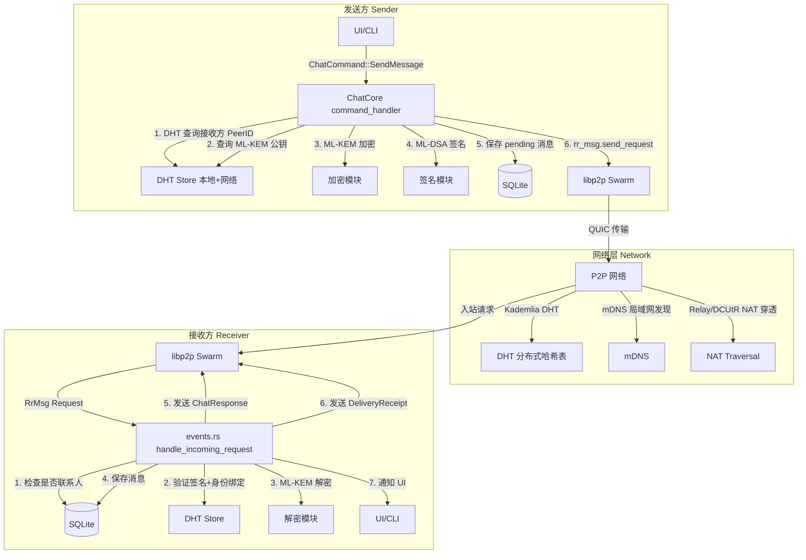
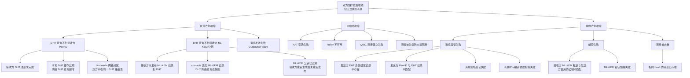
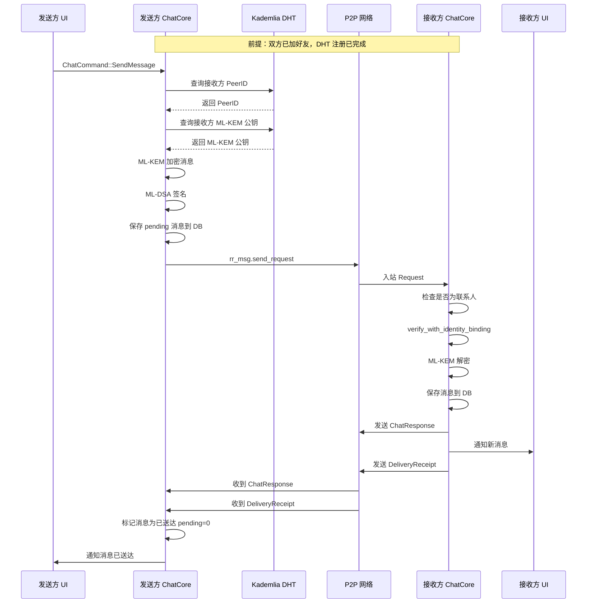
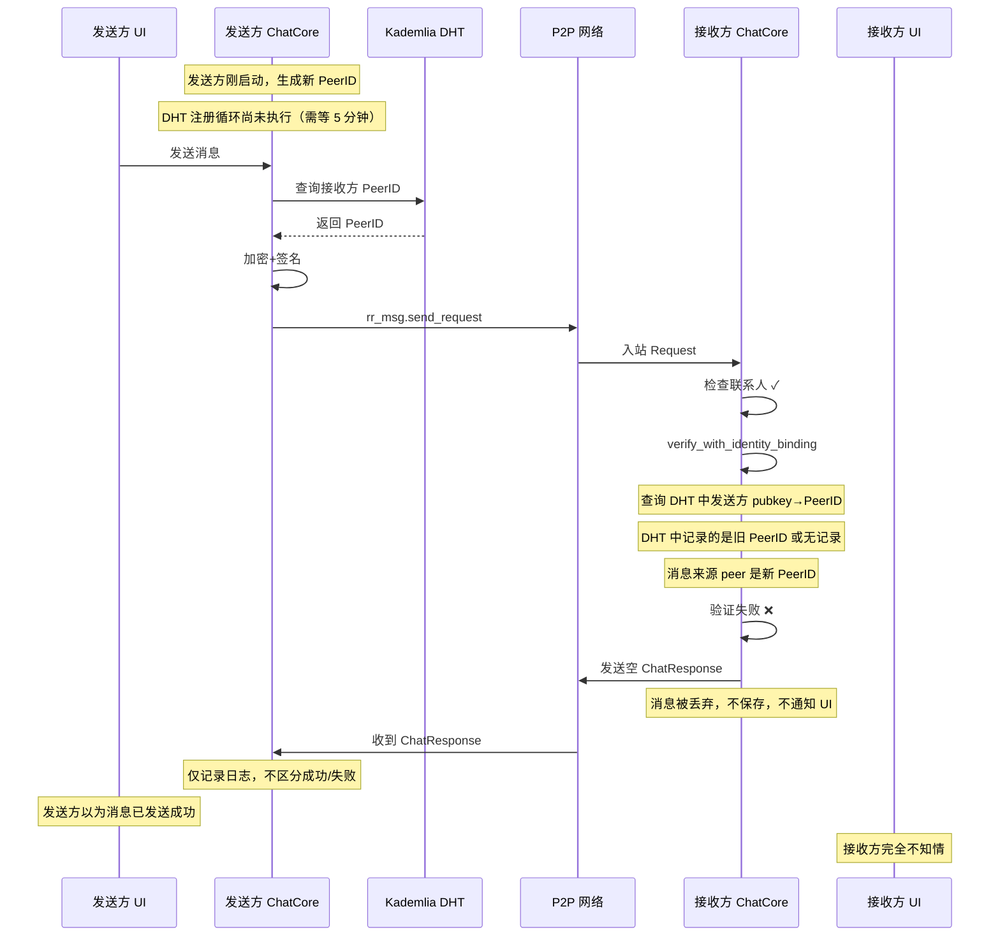

# 消息链路建模文档

## 1. 概述

本文档对 P2P 聊天系统的消息链路进行完整建模，涵盖从发送方发起消息到接收方收到消息并返回送达回执的完整生命周期。重点分析"双方加好友后且都在线却无法收到消息"这一问题的潜在故障点。

> **实际日志证据**（用户报告）：
>
> ```
> [日志] 消息已保存到离线队列（联系人 3942906c815fd2a6 当前不在线）
> [警告] 发送消息失败: 联系人 3942906c815fd2a6 当前不在线，消息已保存到离线队列
> ```
>
> 这表明故障发生在 **发送方 DHT 查询接收方 PeerID 阶段**：本地 DHT 缓存未命中，网络 DHT 查询也超时/未找到，导致消息被错误地放入离线队列，即使接收方实际在线。

---

## 2. 系统架构概览



---

## 3. 消息链路完整状态机

### 3.1 发送方状态机

```mermaid
stateDiagram-v2
    [*] --> IDLE

    state IDLE {
        [*] --> WaitUserInput
    }

    IDLE --> LOOKUP_PEERID: 用户发送消息\nChatCommand::SendMessage

    state LOOKUP_PEERID {
        [*] --> CheckLocalDHT
        CheckLocalDHT --> FoundLocal: 本地 DHT 命中
        CheckLocalDHT --> QueryNetworkDHT: 本地未命中
        QueryNetworkDHT --> FoundNetwork: 网络 DHT 命中
        QueryNetworkDHT --> TimeoutOrNotFound: 超时/未找到
        FoundLocal --> PeerIDResolved
        FoundNetwork --> PeerIDResolved
        TimeoutOrNotFound --> SAVE_PENDING: 保存离线队列
    end

    PeerIDResolved --> LOOKUP_MLKEM

    state LOOKUP_MLKEM {
        [*] --> CheckContactDB
        CheckContactDB --> FoundInContact: contacts 表有 ML-KEM
        CheckContactDB --> QueryDHTMLKEM: contacts 表无记录
        QueryDHTMLKEM --> FoundMLKEM: DHT 命中
        QueryDHTMLKEM --> MLKEMNotFound: DHT 未找到
        FoundInContact --> MLKEMResolved
        FoundMLKEM --> MLKEMResolved
        MLKEMNotFound --> ERROR_NO_MLKEM: 无法加密
    end

    MLKEMResolved --> ENCRYPT_SIGN

    state ENCRYPT_SIGN {
        [*] --> MLKEMEncrypt
        MLKEMEncrypt --> MLDSASign
        MLDSASign --> MessageReady
    end

    MessageReady --> SAVE_PENDING_WITH_HASH: 保存 pending 消息到 DB

    SAVE_PENDING_WITH_HASH --> SEND_NETWORK

    state SEND_NETWORK {
        [*] --> rr_msg_send_request
        rr_msg_send_request --> WaitingResponse
        WaitingResponse --> ResponseReceived: 收到 ChatResponse
        WaitingResponse --> OutboundFailure: 发送失败
        WaitingResponse --> Timeout: 超时
    end

    ResponseReceived --> WAIT_DELIVERY_RECEIPT

    state WAIT_DELIVERY_RECEIPT {
        [*] --> WaitingReceipt
        WaitingReceipt --> ReceiptReceived: 收到 DeliveryReceipt
        WaitingReceipt --> ReceiptTimeout: 超时未收到
    end

    ReceiptReceived --> MARK_SENT: 标记 pending=0
    ReceiptTimeout --> KEEP_PENDING: 保持 pending=1

    MARK_SENT --> IDLE
    KEEP_PENDING --> IDLE
    SAVE_PENDING --> IDLE
    ERROR_NO_MLKEM --> IDLE
    OutboundFailure --> IDLE
```

### 3.2 接收方状态机

```mermaid
stateDiagram-v2
    [*] --> LISTENING

    state LISTENING {
        [*] --> WaitIncomingRequest
    end

    LISTENING --> CHECK_CONTACT: 收到 rr_msg Request

    state CHECK_CONTACT {
        [*] --> IsKnownContact
        IsKnownContact --> UnknownContact: 非联系人，拒绝
        IsKnownContact --> KnownContact: 是联系人
        UnknownContact --> SEND_RESPONSE_DENY: 发送空响应
    end

    KnownContact --> VERIFY_MESSAGE

    state VERIFY_MESSAGE {
        [*] --> CheckFreshness
        CheckFreshness --> StaleMessage: 消息过期
        CheckFreshness --> FreshMessage
        FreshMessage --> CheckHash
        CheckHash --> HashMismatch: 完整性校验失败
        CheckHash --> HashMatch
        HashMatch --> CheckSignature
        CheckSignature --> InvalidSignature: 签名无效
        CheckSignature --> ValidSignature
        ValidSignature --> CheckIdentityBinding
        CheckIdentityBinding --> BindingMismatch: DHT 身份绑定不匹配
        CheckIdentityBinding --> BindingMatch
        BindingMatch --> VerificationPassed
    end

    StaleMessage --> SEND_RESPONSE
    HashMismatch --> SEND_RESPONSE
    InvalidSignature --> SEND_RESPONSE
    BindingMismatch --> SEND_RESPONSE

    VerificationPassed --> DECRYPT_MESSAGE

    state DECRYPT_MESSAGE {
        [*] --> LoadMLKEMPrivateKey
        LoadMLKEMPrivateKey --> KeyLoadFailed: 私钥加载失败
        LoadMLKEMPrivateKey --> KeyLoaded
        KeyLoaded --> MLKEMDecrypt
        MLKEMDecrypt --> DecryptFailed: 解密失败
        MLKEMDecrypt --> DecryptSuccess
    end

    KeyLoadFailed --> SEND_RESPONSE
    DecryptFailed --> SEND_RESPONSE

    DecryptSuccess --> SAVE_MESSAGE

    SAVE_MESSAGE --> SEND_RESPONSE: 发送 ChatResponse

    SEND_RESPONSE --> SEND_DELIVERY_RECEIPT: 仅 Text 类型

    state SEND_DELIVERY_RECEIPT {
        [*] --> LookupSenderPeerID
        LookupSenderPeerID --> FoundSenderPeerID
        LookupSenderPeerID --> SenderPeerIDNotFound
        FoundSenderPeerID --> BuildReceiptMessage
        BuildReceiptMessage --> SendReceipt
    end

    SendReceipt --> NOTIFY_UI
    SenderPeerIDNotFound --> NOTIFY_UI

    NOTIFY_UI --> LISTENING
    SEND_RESPONSE_DENY --> LISTENING
```

---

## 4. 消息链路数据流详细分析

### 4.1 发送方完整流程（`command_handler.rs` `send_text`）

```
send_text(mldsa_pubkey_hex, msgtype, data)
  │
  ├─ 1. DHT 查询接收方 PeerID
  │    ├─ get_dht_store().get_peerid_by_pubkey()  // 本地 DHT 数据库
  │    ├─ 命中 → 使用缓存的 PeerID
  │    └─ 未命中 → lookup_peerid_by_pubkey_network()  // 网络 Kademlia get_record
  │         ├─ 命中 → 缓存到本地 DHT 数据库
  │         ├─ 未命中 → save_pending_message() + 返回错误
  │         └─ 超时/失败 → save_pending_message() + 返回错误
  │
  ├─ 2. 查询接收方 ML-KEM 公钥（用于端到端加密）
  │    ├─ storage::get_contact_mlkem_pubkey()  // contacts 表
  │    ├─ 命中 → 使用
  │    └─ 未命中 → DHT 查询 get_mlkem_pubkey()
  │         ├─ 命中 → 使用
  │         └─ 未命中 → 返回错误 "未找到 ML-KEM 公钥"
  │
  ├─ 3. crypto::encrypt_message(data, recipient_mlkem_pubkey)
  │
  ├─ 4. build_signed_message(msgtype, encrypted_data)
  │    ├─ ChatMessage::new_signed()
  │    │   ├─ 生成 timestamp + nonce
  │    │   ├─ SHA256(msgtype || timestamp || nonce || data) → hash
  │    │   └─ ML-DSA sign(hash) → signature
  │
  ├─ 5. save_pending_message_with_hash()  // 保存到 DB，pending=1
  │
  └─ 6. send_message(recipient_peer_id, message)
       └─ swarm.behaviour_mut().rr_msg.send_request(&peerid, message)
```

### 4.2 接收方完整流程（`events.rs` `handle_incoming_request`）

```
handle_incoming_request(core, peer, channel, request)
  │
  ├─ 1. 检查发送方是否为已添加的联系人
  │    └─ storage::is_contact_exists()
  │    └─ 非联系人 → send_response() + return
  │
  ├─ 2. handle_message_verification()
  │    ├─ request.verify_with_identity_binding(&store, Some(peer))
  │    │   ├─ is_fresh()  // 检查时间戳新鲜度
  │    │   ├─ 计算 hash 比对  // 完整性校验
  │    │   ├─ verify_signature()  // ML-DSA 签名验证
  │    │   └─ DHT 身份绑定验证
  │    │       ├─ store.get_peerid_by_pubkey(sender_pubkey_hex)
  │    │       └─ 比对 DHT 中的 PeerID 与消息来源 peer
  │    └─ 验证失败 → send_response() + return
  │
  ├─ 3. handle_decrypted_message()
  │    ├─ 加载 ML-KEM 私钥（PrivateKeyHandle::load）
  │    ├─ crypto::decrypt_message(request.data, mlkem_private_key)
  │    └─ 按 msgtype 分发
  │
  ├─ 4. send_response()  // 发送 ChatResponse 确认
  │
  ├─ 5. 如果是 Text 类型，发送 DeliveryReceipt
  │    ├─ 从 DHT 查找发送方 PeerID
  │    ├─ build_signed_message(DeliveryReceipt, hash_hex)
  │    └─ send_message(sender_peer_id, receipt_msg)
  │
  └─ 6. 通知 UI（send_message_mpsc）
```

---

## 5. 关键数据依赖关系

### 5.1 发送消息所需的前提条件

| 依赖项 | 来源 | 缺失后果 |
|--------|------|----------|
| 接收方 PeerID | DHT 本地缓存 / 网络 DHT 查询 | 消息进入离线队列 |
| 接收方 ML-KEM 公钥 | contacts 表 / DHT 查询 | 无法加密，消息发送失败 |
| 自身 ML-DSA 私钥 | 内存缓存（Zeroizing） | 无法签名 |
| 自身 ML-KEM 私钥 | Keyring 安全存储 | 无法解密收到的消息 |

### 5.2 接收消息所需的前提条件

| 依赖项 | 来源 | 缺失后果 |
|--------|------|----------|
| 发送方在 contacts 表中 | SQLite | 消息被拒绝 |
| 发送方 DHT 身份绑定记录 | DHT 本地数据库 | 身份验证失败 |
| 自身 ML-KEM 私钥 | Keyring 安全存储 | 无法解密 |
| 发送方 PeerID（用于回执） | DHT 本地缓存 | 无法发送送达回执 |

---

## 6. 故障点分析："双方加好友后且都在线却无法收到消息"

### 6.1 实际日志定位故障点

用户报告的实际日志：

```
[日志] 消息已保存到离线队列（联系人 3942906c815fd2a6 当前不在线）
[警告] 发送消息失败: 联系人 3942906c815fd2a6 当前不在线，消息已保存到离线队列
```

**日志分析**：这两条日志来自 [`command_handler.rs`](chat_core/src/core/command_handler.rs) 的 `send_text()` 方法中的以下代码路径：

1. `"消息已保存到离线队列"` — 来自 [`save_pending_message()`](chat_core/src/core/command_handler.rs:302-307) 或 [`send_text()` 的 Err 分支](chat_core/src/core/command_handler.rs:165-168)
2. `"发送消息失败: 联系人 ... 当前不在线"` — 来自 [`handle_command()`](chat_core/src/core/command_handler.rs:17-18) 的 `SendMessage` 匹配分支

**结论**：故障发生在 `send_text()` 的 **DHT 查询接收方 PeerID 阶段**（第 1 步），具体是：

- 本地 DHT 缓存未命中接收方的 PeerID
- 网络 DHT 查询（`lookup_peerid_by_pubkey_network`）超时或未找到
- 消息被放入离线队列

### 6.2 故障树分析



### 6.2 各故障点详细分析

#### 故障点 A1：DHT 查询不到接收方 PeerID

**根因分析：**

1. **接收方 DHT 注册未完成**（最可能的原因）
   - 接收方启动后，DHT 注册循环每 5 分钟执行一次（[`DHT_REGISTRATION_INTERVAL_SECS`](chat_core/src/core/mod.rs:15) = 300 秒）
   - 如果接收方刚上线，首次 DHT 注册可能尚未完成
   - 注册循环通过 [`publish_identity_to_dht()`](chat_core/src/core/dht_ops.rs:12) 发布 `peerid:{pubkey}` 和 `mlkem:{pubkey}` 两条记录
   - `put_record` 使用 `Quorum::One`，只需一个节点确认即可，但 Kademlia 网络传播需要时间

2. **本地 DHT 缓存过期 + 网络查询超时**
   - 发送方本地 DHT 缓存每 30 分钟（6 tick × 5 分钟）清理一次（[`clear_expired_pubkey_peerid_cache`](chat_core/src/core/event_loop.rs:195)）
   - 网络 DHT 查询超时 30 秒（[`lookup_peerid_by_pubkey_network`](chat_core/src/p2p/mod.rs:172)）
   - 如果 Kademlia 网络中没有足够节点持有该记录，查询会超时

3. **Kademlia 网络分区**
   - 双方可能连接到不同的 bootstrap 节点
   - DHT 记录尚未复制到发送方所在的路由表区域

#### 故障点 A2：DHT 查询不到接收方 ML-KEM 公钥

**根因分析：**

1. **接收方未发布 ML-KEM 记录**
   - 检查 [`publish_identity_to_dht()`](chat_core/src/core/dht_ops.rs:82)：如果 `mlkem_pubkey_hex` 为空字符串，跳过 ML-KEM 发布
   - 如果接收方身份初始化时 ML-KEM 公钥生成失败，则不会发布

2. **contacts 表无 ML-KEM 记录**
   - 加好友时通过 [`add_contact`](chat_core/src/core/command_handler.rs:435) 保存 ML-KEM 公钥到 contacts 表
   - 如果加好友流程中 ML-KEM 公钥未正确传递（例如二维码扫描失败），contacts 表中 ML-KEM 字段为空
   - 此时会回退到 DHT 网络查询，如果 DHT 也没有则失败

3. **ML-KEM 公钥已过期**
   - ML-KEM 密钥对每次启动重新生成（[`generate_complete_identity`](chat_core/src/core/mod.rs:94)）
   - 如果接收方重启后生成了新 ML-KEM 密钥对，但发送方 contacts 表中仍存的是旧 ML-KEM 公钥
   - 发送方先查 contacts 表，拿到旧公钥 → 加密 → 接收方用新私钥解密失败
   - 或者 contacts 表为空，查 DHT 拿到新公钥 → 成功

#### 故障点 B：网络层故障

**根因分析：**

1. **NAT 穿透失败**
   - 双方都在 NAT 后，Relay 中继不可用或 DCUtR 直连升级失败
   - libp2p 使用 QUIC 传输，但 QUIC 基于 UDP，某些网络环境可能封锁 UDP
   - 连接建立失败导致 `rr_msg.send_request` 无法投递

2. **连接已建立但消息未到达**
   - 即使 `ConnectionEstablished` 事件触发，`rr_msg` 请求仍可能因流控、背压等原因失败
   - 接收方 [`handle_incoming_request`](chat_core/src/p2p/events.rs:560) 中如果验证失败，仅发送空 `ChatResponse`，不返回错误
   - 发送方收到 `Response` 后仅记录日志（[`events.rs:46-56`](chat_core/src/p2p/events.rs:46)），不区分成功/失败响应

#### 故障点 C1：消息验证失败

**根因分析：**

1. **DHT 身份绑定记录不存在**（关键故障点）
   - [`verify_with_identity_binding()`](chat_core/src/message/mod.rs:186) 要求发送方的 ML-DSA 公钥在 DHT 中有合法的身份绑定记录
   - 如果发送方尚未完成 DHT 注册（每 5 分钟一次），DHT 中无此记录
   - 接收方验证失败，消息被丢弃

2. **发送方 PeerID 与 DHT 记录不匹配**
   - 发送方每次启动生成新的临时 PeerID（[`generate_temporary_peerid`](chat_core/src/core/mod.rs:127)）
   - 如果发送方重启后，DHT 中仍存的是旧 PeerID 记录
   - 接收方验证时，消息来源 peer（新 PeerID）与 DHT 记录（旧 PeerID）不匹配
   - **这是最关键的故障场景之一**

3. **消息签名验证失败**
   - 发送方使用内存缓存的 ML-DSA 私钥签名
   - 如果私钥缓存被意外清零（Zeroizing drop），签名会失败
   - 但这种情况会在发送方侧报错，不会导致"收不到"

4. **消息时间戳新鲜度检查失败**
   - 消息最大允许年龄 1 小时（[`MESSAGE_MAX_AGE_SECS`](chat_core/src/message/mod.rs:15)）
   - 未来时间容差 60 秒（[`MESSAGE_FUTURE_TOLERANCE_SECS`](chat_core/src/message/mod.rs:17)）
   - 如果双方系统时间偏差超过 60 秒，消息会被拒绝

#### 故障点 C2：解密失败

**根因分析：**

1. **ML-KEM 密钥不匹配**（常见故障点）
   - 发送方使用 contacts 表中存储的 ML-KEM 公钥加密
   - 接收方使用当前会话的 ML-KEM 私钥解密
   - 如果接收方重启后生成了新 ML-KEM 密钥对，但发送方 contacts 表中仍是旧公钥
   - 解密失败，消息被丢弃

2. **ML-KEM 私钥加载失败**
   - [`PrivateKeyHandle::load`](chat_core/src/p2p/events.rs:717) 从 Keyring 加载私钥
   - 如果 Keyring 不可用或密码错误，加载失败

#### 故障点 C3：消息被去重

**根因分析：**

- 接收方使用 `message_hash` 字段去重（[`add_message_with_hash`](chat_core/src/storage/message.rs:47)）
- 如果相同 hash 的消息已存在，新消息被跳过
- 但发送方每次生成不同的 `nonce`，hash 不同，正常情况下不会触发

---

## 7. 最可能的故障场景排序

根据**实际日志证据**和代码分析，按可能性从高到低排列：

### 场景 1（最高概率，已确认）：DHT 网络查询超时 → 消息进入离线队列

**实际日志**：

```
[日志] 消息已保存到离线队列（联系人 3942906c815fd2a6 当前不在线）
[警告] 发送消息失败: 联系人 3942906c815fd2a6 当前不在线，消息已保存到离线队列
```

**故障链路**：

```
发送方本地 DHT 无接收方 PeerID 缓存
         ↓
发起网络 Kademlia get_record 查询
         ↓
Kademlia 网络传播延迟 / 节点不足
         ↓
30 秒超时 → 消息进入离线队列
         ↓
即使接收方在线，消息也被当作离线处理
```

**根因分析**：

1. **接收方 DHT 注册未完成或未传播**：接收方启动后，DHT 注册循环每 5 分钟执行一次（[`DHT_REGISTRATION_INTERVAL_SECS`](chat_core/src/core/mod.rs:15) = 300 秒）。如果接收方刚上线，首次 DHT 注册可能尚未完成，或者记录尚未传播到发送方所在的 Kademlia 路由区域。
2. **本地 DHT 缓存过期**：发送方本地 DHT 缓存每 30 分钟清理一次（[`clear_expired_pubkey_peerid_cache`](chat_core/src/core/event_loop.rs:195)），清理后需要重新网络查询。
3. **Kademlia 网络节点不足**：如果网络中只有两个节点（双方），DHT 记录的复制和查询可能不稳定。

**关键代码路径**：

- 发送方：[`send_text()`](chat_core/src/core/command_handler.rs:123-190) → [`lookup_peerid_by_pubkey_network()`](chat_core/src/p2p/mod.rs:138) → 超时后 [`save_pending_message()`](chat_core/src/core/command_handler.rs:163-168)

### 场景 2：DHT 身份绑定验证失败

```
发送方刚启动 → 生成新 PeerID
         ↓
发送方 DHT 注册循环每 5 分钟执行一次
         ↓
接收方收到消息 → verify_with_identity_binding()
         ↓
检查 DHT 中发送方 pubkey → PeerID 映射
         ↓
DHT 中记录的是旧 PeerID（或不存在）
         ↓
验证失败 → 消息被丢弃
```

**关键代码路径：**

- 发送方：[`publish_identity_to_dht()`](chat_core/src/core/dht_ops.rs:12) — 每 5 分钟发布一次
- 接收方：[`handle_message_verification()`](chat_core/src/p2p/events.rs:656) → [`verify_with_identity_binding()`](chat_core/src/message/mod.rs:186)
- 验证失败日志：`"身份绑定验证失败: ML-DSA ... 的 DHT PeerID ... 与消息来源 PeerID ... 不匹配"`

### 场景 2：ML-KEM 密钥不匹配

```
发送方 contacts 表中存的是旧 ML-KEM 公钥
         ↓
发送方用旧公钥加密消息
         ↓
接收方用当前会话的新 ML-KEM 私钥解密
         ↓
解密失败 → 消息被丢弃
```

**关键代码路径：**

- 发送方：[`send_text()`](chat_core/src/core/command_handler.rs:197) — 从 contacts 表获取 ML-KEM 公钥
- 接收方：[`handle_decrypted_message()`](chat_core/src/p2p/events.rs:700) → [`decrypt_message()`](chat_core/src/p2p/events.rs:732)
- 解密失败日志：`"解密来自 ... 的消息失败: 可能是对方的 ML-KEM 公钥已过期"`

### 场景 3：DHT 网络查询超时

```
发送方本地 DHT 无接收方 PeerID 缓存
         ↓
发起网络 Kademlia get_record 查询
         ↓
Kademlia 网络传播延迟 / 节点不足
         ↓
30 秒超时 → 消息进入离线队列
         ↓
即使接收方在线，消息也被当作离线处理
```

### 场景 4：NAT/连接问题

```
双方都在 NAT 后
         ↓
QUIC UDP 被防火墙阻断
         ↓
Relay 中继不可用
         ↓
连接无法建立 → rr_msg 发送失败
```

---

## 8. 改进建议

### 8.1 立即修复（高优先级）

1. **DHT 注册加速**：在 [`ChatCore::try_init`](chat_core/src/core/mod.rs:80) 完成后，立即执行一次 DHT 身份发布，而不是等待 5 分钟后的首次定时注册。

2. **连接建立后主动发布身份**：在 [`ConnectionEstablished`](chat_core/src/p2p/events.rs:147) 事件处理中，触发一次立即的 DHT 身份发布。

3. **消息验证降级策略**：在 [`verify_with_identity_binding()`](chat_core/src/message/mod.rs:186) 中，如果 DHT 身份绑定验证失败，增加一个降级路径：允许来自已知联系人的消息通过基础验证（签名+哈希），并记录警告。

### 8.2 中期改进（中优先级）

1. **ML-KEM 公钥自动同步**：在收到消息后，如果解密成功，自动更新 contacts 表中的 ML-KEM 公钥为最新值。

2. **离线消息重试机制增强**：当前重试仅在 [`ConnectionEstablished`](chat_core/src/p2p/events.rs:154) 时触发，应增加定期重试（如每 30 秒）。

3. **发送方主动重拨**：在 [`OutgoingConnectionError`](chat_core/src/p2p/events.rs:191) 或 [`OutboundFailure`](chat_core/src/p2p/events.rs:59) 时，增加重试逻辑。

### 8.3 长期改进（低优先级）

1. **连接状态跟踪**：增加每个联系人的连接状态跟踪，在 UI 上显示"在线/离线"状态。

2. **消息投递状态反馈**：增加消息投递状态（已发送/已送达/已读）的端到端确认机制。

---

## 9. 消息链路时序图（正常流程）



---

## 10. 消息链路时序图（故障场景：DHT 身份绑定失败）



---

## 11. 总结

消息链路的核心故障点集中在 **DHT 身份绑定验证** 和 **ML-KEM 密钥同步** 两个环节。由于 PeerID 每次启动重新生成，而 DHT 注册有 5 分钟延迟，导致"刚加好友后立即发消息"的场景最容易触发故障。建议优先实施"启动后立即 DHT 注册"和"连接建立后立即 DHT 注册"两个修复。
