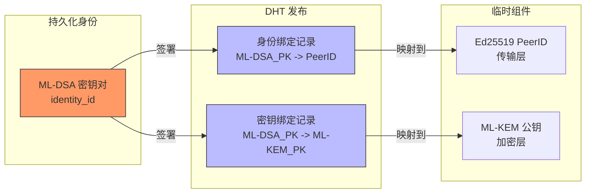
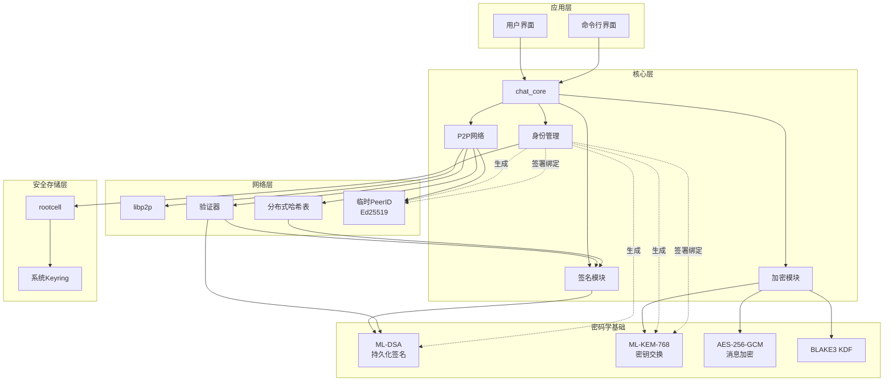
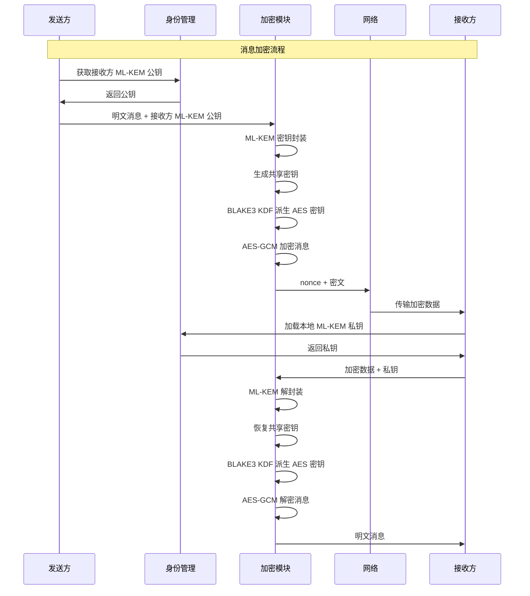
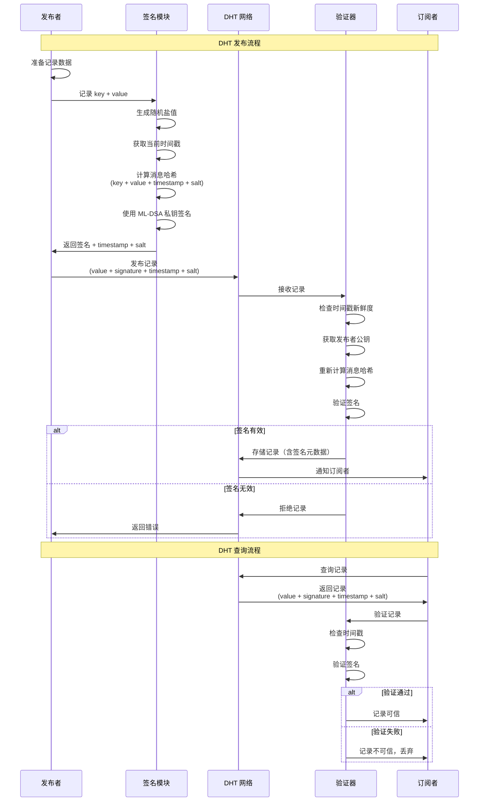

# 聊天应用安全架构分析

## 项目概述

这是一个基于Rust的跨平台聊天应用，采用P2P架构，注重隐私和安全。项目使用现代密码学标准，包括后量子安全的 ML-KEM 和 ML-DSA 算法。

## 编码规范

对于本项目应遵循的代码规范：
应具有基本代码可读性，对于每次修改简单解释，将复杂逻辑拆分便于维护
[代码风格](https://doc.rust-lang.org/nightly/style-guide/)
以安全为前提，功能其次，最后保证性能

## 项目文件

/chat_core -> 项目核心，尽可能减少依赖，减少攻击面

- 通过枚举（MessageEvent）传递结构化数据

/chat_tauri -> tauri框架构建的前端服务

/chat_cli -> ratatui框架构建的命令行服务，支持json格式输出的选项

## 关键安全组件

### 1. 身份管理系统 (chat_core/src/identity.rs)

**三层身份架构**:

- **ML-DSA 持久化身份**（核心身份）: 用于数字签名和身份验证
  - 公钥作为用户的**全局唯一持久化身份标识**（`identity_id`）
  - 用于签署所有 DHT 操作、消息签名、身份绑定
  - 私钥只安全存储在系统 keyring 中
  - 使用 `aws-lc-rs` 的 `unstable` feature 中的 `ML_DSA_65`（推荐平衡级）
  - API: `PqdsaKeyPair::generate(&ML_DSA_65_SIGNING)` 生成密钥对
  - API: `key_pair.sign(message, &mut signature)` 签名
  - API: `UnparsedPublicKey::new(&ML_DSA_65, public_key).verify(message, signature)` 验证
  
- **临时 PeerID (Ed25519)**: 仅用于传输层连接和路由
  - 每次启动可变化
  - 与持久化 ML-DSA 身份解耦，提供匿名性
  - 通过 DHT 发布签名的身份绑定记录，将 PeerID 关联到 ML-DSA 公钥
  - 绑定记录使用 ML-DSA 私钥签名，确保所有权

- **ML-KEM 密钥交换**: 用于端到端加密
  - NIST 标准化的后量子密钥封装机制
  - ML-KEM 公钥也通过 DHT 发布，使用 ML-DSA 签名绑定到身份
  - 联系人通过 ML-DSA 公钥查找对方的 ML-KEM 公钥用于加密

**身份绑定架构**:



### 2. 加密系统 (chat_core/src/crypto.rs)

- **ML-KEM-768**: NIST标准化的后量子密钥封装机制
  - 用于密钥交换/封装
  - 提供量子计算抵抗能力
  
- **AES-256-GCM**: 对称加密用于消息内容
  - 经过审计的实现
  - 提供认证加密
  
- **混合加密架构**:
  1. ML-KEM 封装共享密钥
  2. BLAKE3 KDF 派生 AES 密钥
  3. AES-GCM 加密消息内容
  
- **恒定时间比较**: 防止时序攻击
- **BLAKE3 KDF**: 密钥派生函数，带上下文信息防止密钥误用

### 3. 签名系统 (chat_core/src/signature.rs)

- **ML-DSA/Ed25519 签名**: 用于身份验证和数据完整性
  - 使用dht时应当同时签名 身份的ML-DSA和peerid对应Ed25519，确保所有权
- **DHT 记录签名**: 所有 DHT 操作必须签名
  - 包含时间戳防止重放攻击
  - 包含随机盐值混淆防止彩虹表攻击
  - 签名验证强制执行

### 4. 密钥存储系统 (rootcell/src/identity.rs)

- **多层存储策略**:
  - 优先使用系统keyring (macOS Keychain, Windows Credential Manager, Linux Secret Service)
  - 失败时报错提醒用户
  
- **内存安全特性**:
  - `mlock()`防止内存交换到磁盘（Unix/Windows）
  - `zeroize`自动清理敏感数据
  - 防克隆保护
  
- **跨平台支持**: Unix/Windows兼容

### 5. P2P网络安全 (chat_core/src/p2p/validator.rs)

- **挑战-响应验证**: 防止DHT滥用
  - 所有挑战响应必须签名
  - 验证节点公钥所有权
  
- **资源限制**: 每个节点的最大记录数
- **统计跟踪**: 节点行为监控
- **超时清理**: 自动清理过期挑战
- **签名验证**: 强制执行所有 DHT 记录的签名验证
  - 检查时间戳新鲜度（默认60秒）
  - 验证盐值存在
  - 使用发布者公钥验证签名

### 6. DHT 安全增强 (chat_core/src/p2p/dht.rs)

- **提供者记录签名**: Provider records 同样包含签名
- **资源限制**: 防止单个节点滥用存储空间

### 7. 安全依赖库

- `aws-lc-rs`: AWS的密码学库，提供 ML-KEM 和 ML-DSA 算法
- `aes-gcm`: 经过审计的AES-GCM实现
- `zeroize`: 安全内存清理
- `keyring`: 系统密钥环访问
- `blake3`: 快速安全的哈希函数和KDF
- 使用了 libp2p

---

## 🔴 仍存在的问题

### 问题 14: 缺少安全启动验证和完整性检查

**严重性**: 🟢 低

**描述**:

- 应用启动时没有验证数据库文件的完整性
- 没有检查关键文件（如 `dht.redb`、`database.sqlite`）是否被篡改
- 没有进程间隔离保护

**建议**:

- 对关键数据文件计算并存储 HMAC/SHA-256 校验和
- 启动时验证文件完整性
- 考虑使用 Tauri 的强隔离模式

---

## 安全架构图



## 加密流程



## DHT 操作流程（带签名）



## 密钥存储流程

```mermaid
flowchart TD
    Start[保存私钥] --> CheckType{私钥类型}
    
    CheckType -->|ML-DSA| MldsaPath[ML-DSA 私钥路径]
    CheckType -->|ML-KEM| MlkemPath[ML-KEM 私钥路径]
    
    MldsaPath --> TryKeyring1{尝试Keyring}
    MlkemPath --> TryKeyring2{尝试Keyring}
    
    TryKeyring1 -->|成功| KeyringSave1[保存到系统Keyring<br/>ID: {identity_id}_mldsa]
    TryKeyring2 -->|成功| KeyringSave2[保存到系统Keyring<br/>ID: {identity_id}_mlkem]
    
    TryKeyring1 -->|失败| Error1[报错：Keyring不可用]
    TryKeyring2 -->|失败| Error2[报错：Keyring不可用]
    
    KeyringSave1 --> Mlock[内存锁定 mlock]
    KeyringSave2 --> Mlock
    
    Mlock --> Done[完成保存]
    
    Load[加载私钥] --> CheckLoadType{私钥类型}
    
    CheckLoadType -->|ML-DSA| LoadMldsa[加载 ML-DSA 私钥]
    CheckLoadType -->|ML-KEM| LoadMlkem[加载 ML-KEM 私钥]
    
    LoadMldsa --> TryLoadKeyring1{尝试Keyring加载}
    LoadMlkem --> TryLoadKeyring2{尝试Keyring加载}
    
    TryLoadKeyring1 -->|成功| KeyringLoad1[从Keyring加载]
    TryLoadKeyring2 -->|成功| KeyringLoad2[从Keyring加载]
    
    TryLoadKeyring1 -->|失败| Error3[加载失败]
    TryLoadKeyring2 -->|失败| Error4[加载失败]
    
    KeyringLoad1 --> Mlock2[内存锁定]
    KeyringLoad2 --> Mlock2
    
    Mlock2 --> Ready[私钥就绪]
```

---

## 问题状态总结

| 状态 | 优先级 | 问题 | 影响 | 说明 |
|------|--------|------|------|------|

| 🔴 未修复 | 🟢 P3 | 问题14: 缺少启动完整性检查 | 文件篡改风险 | 需要添加 HMAC 校验 |
